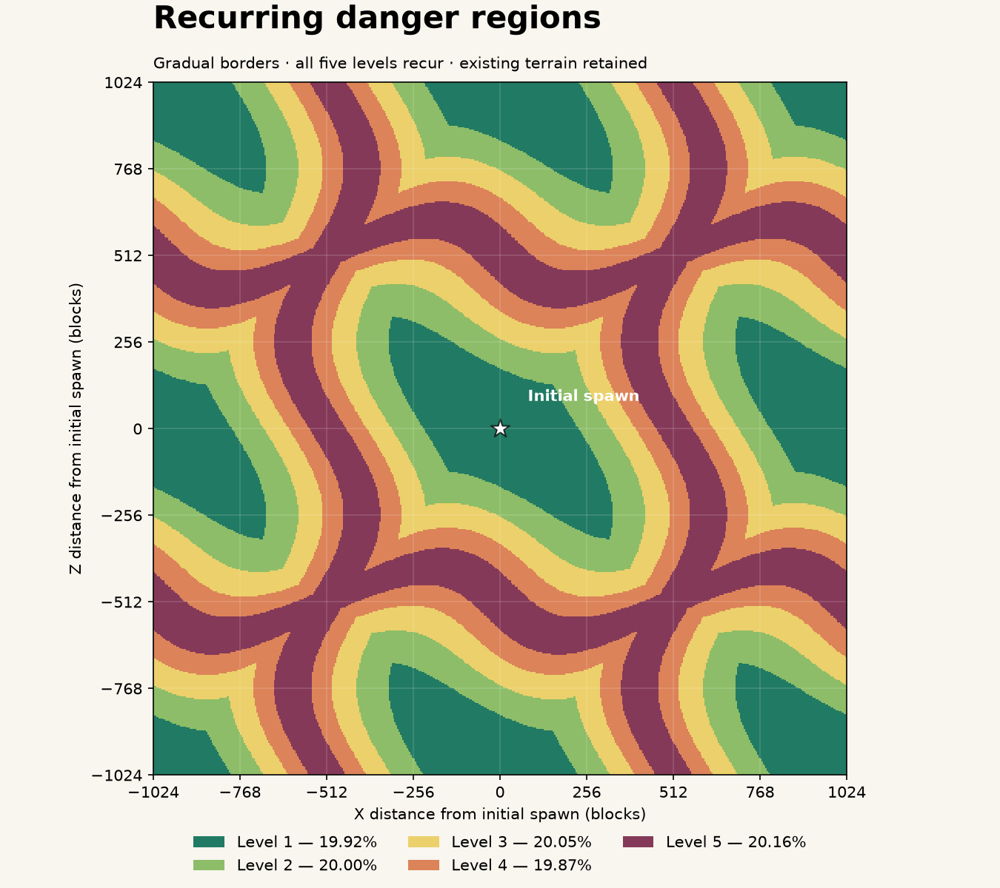
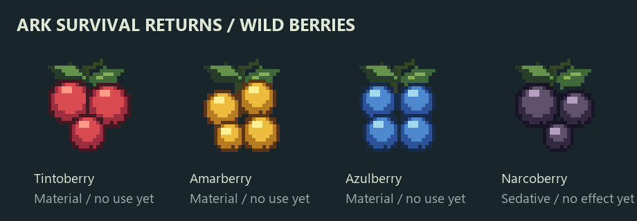

# Ark Survival Returns

A prehistoric wildlife mod for Minecraft Java **26.1.2**, NeoForge **26.1.2.109**, Java **25** and GeckoLib **5.5.2**. Mod ID: `arksurvivalreturns`.

## Play on Windows

**Double-click `Start-Ark-Mod.bat` in the repository root.** It builds the mod and opens Minecraft with NeoForge and GeckoLib loaded. VS Code and a separate Minecraft launcher are not needed. Keep the console open while playing; the first launch may take a few minutes. Startup errors remain visible in the console. The dev client uses a 16 GB maximum heap. The launcher sets the selected Java executables to Windows high-performance GPU preference for the NVIDIA adapter.

PowerShell alternative: `.\Start-Ark-Mod.ps1`. The launcher finds JDK 25 through `JAVA_HOME`, JBang or `PATH`, and uses the project Gradle wrapper. Its execution-policy override applies only to its own process. `Start-Ark-Mod.bat -Check` builds and prepares the client without opening the game.

## Playable systems

- **Debug Spyglass:** hold use while aiming at a dinosaur for a green terminal inspector of live stats, AI/flight variables and saved data. Scroll to page through values. Obtain it from the Ark creative tab or `/give @s arksurvivalreturns:debug_spyglass`. See [controls and limits](docs/debug-spyglass.md).
- **Taming, torpor and riding:** every one of the 41 registered creatures has a taming profile and a measured rider seat. Feed berries, plants, raw meat or fish to a willing creature, or knock a large or dangerous one out with narcoberries and tranquilizer arrows and feed it from its own inventory. Tame it, saddle it and ride it. Tribe members can be granted riding, cargo and order permissions with `/arktribe`. See [the roster and seat manifest](docs/taming-roster.md) and [the debugging guide](docs/taming-debugging.md).
- **Field Journal and tribes:** craft a Field Journal (book + two leather), then press **J** or use it to open the tribe's shared quest journal. FTB Teams is the tribe: create a party with `/ftbteams`, invite your partner, and work through the Primitive and Camp and Recovery chapters together. See [the journal and tribe stack](docs/journal-tribe.md).
- **Camp and rescue:** plant fiber drops from grass, the primitive bedroll sets a respawn point that survives the block, and a hit that would kill leaves you downed for a minute instead of dead — a tribe member revives you with a fiber bandage. `[camp]` and `[downed]` settings tune it. See [camp and rescue](docs/recovery.md).
- **Keratin tier:** horned, plated and beaked creatures (and goats) drop keratin for the first armour set and the Keratin Spear, a vanilla spear with a Better Combat two-handed stab. A Sharp Rock, knapped from two rocks, tips arrows in place of flint.
- **Weight and working tames:** survivors and tames now haul a measured load. The HUD shows the load and warns before it matters; only past 100% does sprint lock and movement slow, and slot moves are never blocked. Craft a pack or reinforced harness to unlock a species' cargo capacity, then use the tame screen's Load/Unload buttons to move goods to nearby storage. Overloaded flyers refuse to take off and descend in control, overloaded swimmers cannot dive and surface before the rider drowns, and a Triceratops or Ankylosaurus given the new WORK whistle order forages or mines inside a bounded, supervised job site — never touching player-built blocks. See [weight and working tames](docs/weight-and-work.md).
- **Cozy camp art:** a sage canvas bedroll with a rolled carry model, resin-sealed troughs in ten woods, stackable racks with visible drying food, and a cooking pot on a campfire trivet. See the [model collection](docs/camp-assets.png) and [crafting details](docs/homestead.md).
- **Homestead economy:** plant the four Ark berries into renewable bushes, feed your tames from a trough, dry raw food into portable rations, and cook hearty stew or trail mix in the cooking pot. Minecraft furnaces handle smelting, while ordinary chests and barrels accept tame Load/Unload transfers until the planned Tom's Storage integration. See [homestead economy](docs/homestead.md).

The launcher also loads the pinned gameplay stack — FTB Quests, FTB Teams, FTB Library, FTB XMod Compat and JEI — plus the optional client pack: Xaero World Map with the difficulty overlay, Sodium and Iris. AmbientSounds, footsteps and Sound Physics are integrated directly into Ark Survival Returns rather than loaded as standalone mods. Complementary Reimagined is downloaded; enable it in Video Settings → Shader Packs. Taming a creature from a difficulty-5 region unlocks the map; while `progression.mapRequiresUnlock=false` (the default) everyone sees it without the entitlement. See [installation, versions and map controls](docs/client-pack.md) and [the journal and tribe stack](docs/journal-tribe.md).

- Forty-one species using the supplied models, original palette textures and 298 movement, attack, water and behavioral clips. Runtime copies are normalized to entity height; original projects remain in `../Creatures`. A renderer correction aligns the imported +Z-facing skeletons with forward entity movement.
- Replenished natural groups across Overworld biomes, solitary large creatures, terrain checks, population limits and spacing.
- Five recurring danger ranks, persistent random creature levels, independently scaled HP/damage and biome-entry chat messages.
- Look at a creature within 32 blocks for its name, level and current/max HP in a boss-style bar. Walls block targeting. Players have independent bars; predators are red and other creatures green.
- Four complete berry items, textures, inventory models, English/Portuguese names and grass loot integration; forty-one matching spawn eggs in the Ark creative tab.
- Ten additional land creatures share existing behavior families, including timid small-herbivore herds. See [the expansion mapping and limitations](docs/creature-expansion.md).
- Twenty-two collection creatures add water, swamp, cold and flying realms: saved home pools for six water species, semi-aquatic shorelines that switch to swim clips, snow-supported hydration for the cold six, three more nest colonies and a solo apex flyer that guards its roost. See [the collection ecosystem](docs/collection-ecosystem.md).

## Theme alignment

Wildlife survival is the game; Minecraft's fantasy and alternate-dimension content is not. The patch removes that content and keeps the mundane materials a survivor still needs.

- The **Nether and the End** cannot be entered: portals cannot be lit, every dimension change is cancelled, and `allow_entering_nether_using_portals` is forced off. Ruined portals, strongholds, end cities, fortresses and bastions no longer generate. A character saved inside either dimension is returned to safe Overworld ground on join and on respawn; dimension ids and saved data are untouched.
- Fantasy hostiles are gone, including every variant of this version: zombies, drowned, husks, zombie villagers and zombies' aquatic, camel and horse forms; skeletons, strays, bogged, parched and wither skeletons; creepers; endermen, endermites, shulkers and the Ender Dragon; witches and all illagers with their vexes and ravagers; phantoms; slimes, magma cubes and sulfur cubes; guardians; blazes, breezes and ghasts; piglins, hoglins and zoglins; wardens and the creaking; silverfish; cave spiders; iron, snow and copper golems; and the Wither. Ordinary spiders, all ordinary animals, villagers and every mod creature stay.
- Enchanting, brewing and potions, teleportation items, totems, soul items, beacons, conduits, respawn anchors, ender chests, elytra, sculk gameplay and fantasy progression tiers such as netherite are removed, including from existing inventories and worlds.
- Monster rooms, trial chambers, ancient cities, woodland mansions, pillager outposts, witch huts and ocean monuments no longer generate, and raids, patrols, sieges and phantom flybys cannot start. Villages, mineshafts, ocean ruins, shipwrecks, temples and trail ruins keep generating.
- Bones now come from animal carcasses (23 vanilla animals, 1–2 at 75%), so bone meal and wolf taming survive the skeletons. Gunpowder and slime balls keep the wandering trader as their grounded source; string, leather, feathers and wool were never at risk. See [the removal decisions, retained sources and limitations](docs/theme-alignment.md).

## Spawn rules

Every **Overworld biome**, including modded biomes, can host land wildlife on suitable dry surface terrain. Flying colonies additionally require shoreline sand for Pteranodon or a nest floor at Y≥96 for Argentavis; Quetzal roosts at Y≥110, Archaeopteryx nests on forest ground and Dragon roosts on high peaks. Water species need a loaded pool of connected deep water, semi-aquatic species a bank next to exposed water, and cold species accept snow cover or ice over water as their drink source. Habitat tags are preferences: matching habitats receive three times the selection weight. Spawns require a supported footprint, collision-free space, the world border, and at least 24 blocks from players. Forest canopies are allowed; underground rooms and underwater locations are excluded for land species. There is no natural spawning in the Nether or End.

The population director checks every **5 seconds**, targeting **3 distinct wild groups within 96 blocks** of each active player. It adds at most **2 groups per dimension per check**, samples positions 32–80 blocks away in already loaded, entity-ticking chunks, and serves multiplayer players in rotation. Nearby players share wildlife counts. Searches have a fixed attempt budget and never request chunks. Insufficient land or a population cap can delay the target; later checks retry.

Minecraft's animal spawn cycle no longer controls Ark encounter frequency. The `minecraft:spawn_mobs` game rule and the mod's spawning toggle still disable replenishment. Population limits apply to Ark creatures independently of the vanilla animal count.

| Species | Group | Base weight | Base HP | Base damage | Preferred habitats |
|---|---:|---:|---:|---:|---|
| Pteranodon | 3–4 | 18 | 24 | 3 | Beaches, rivers, plains, savanna |
| Velociraptor | 4–6 | 14 | 32 | 5 | Forests, savanna, jungle |
| Argentavis | 3–4 | 4 | 46 | 6 | Taiga and windy mountains |
| Triceratops | 2–4 | 12 | 85 | 8 | Plains, savanna, meadows |
| Therizinosaurus | 2–4 | 12 | 100 | 10 | Jungle, dark forest, swamp, old spruce taiga |
| Brontosaurus | 2–4 | 10 | 145 | 12 | Savanna and sparse jungle |
| Tyrannosaurus | 1 | 12 | 130 | 14 | Badlands, desert, sparse jungle, windswept forest |
| Giganotosaurus | 1 | 8 | 170 | 17 | Windy hills and rocky peaks |
| Titanosaur | 1 | 6 | 190 | 20 | Stony peaks and gravelly hills |
| Cnidaria | 1 | 8 | 12 | 2 | Warm and temperate oceans |
| Plesiosaur | 1 | 8 | 60 | 6 | Oceans and rivers |
| Megalodon | 1 | 7 | 90 | 12 | Oceans and deep oceans |
| Liopleurodon | 1 | 5 | 80 | 11 | Deep oceans |
| Mosasaurus | 1 | 3 | 160 | 18 | Deep oceans |
| Tusoteuthis | 1 | 3 | 150 | 16 | Deep cold and frozen oceans |
| Kaprosuchus | 1 | 7 | 55 | 8 | Swamps, rivers, jungle |
| Sarco | 2–3 | 8 | 70 | 10 | Swamps and rivers |
| Deinosuchus | 1 | 4 | 120 | 14 | Swamps and rivers |
| Titanoboa | 1 | 6 | 45 | 9 | Swamps and jungle |
| Megalocerus | 4–6 | 10 | 60 | 6 | Snowy taiga and plains |
| Unicorn | 1 | 3 | 65 | 7 | Snowy plains and groves |
| Mammoth | 2–4 | 7 | 140 | 12 | Snowy plains, taiga, frozen rivers |
| Direwolf | 4–6 | 9 | 50 | 8 | Snowy taiga and plains |
| Sabertooth | 1–2 | 6 | 60 | 11 | Groves, snowy slopes and peaks |
| Megapithecus | 1 | 1 | 180 | 18 | Frozen and jagged peaks |
| Paraceratherium | 2–4 | 6 | 155 | 13 | Plains, savanna, meadows |
| Terrorbird | 4–6 | 8 | 45 | 9 | Savanna, plains, jungle |
| Ravager | 4–6 | 5 | 65 | 11 | Dark forests and taiga |
| Archaeopteryx | 3–4 | 8 | 10 | 2 | Forests and jungle |
| Quetzal | 1 | 2 | 130 | 10 | Windswept hills and peaks |
| Dragon | 1 | 1 | 190 | 22 | Jagged and frozen peaks |

Natural spawns allow at most **24 Ark creatures within 96 blocks** and require **24 blocks between solitary creatures of the same species**. All living Ark creatures count toward the cap; only natural, unnamed wildlife counts toward the group target. New groups start at least 18 blocks from existing wildlife. Small packs are placed completely or the attempt is abandoned; a cap or obstacle cannot create a lone pack animal. Brontosaurus, Triceratops, Therizinosaurus and Ankylosaurus form herds of 2–4; other large species spawn alone. High-danger replenishment seeks one varied large-creature encounter if none is present, rather than filling a roster of every species. Saved land habitats, water pools and nest colonies are repaired first, so a depleted group refills its own home before a new site is planned. Existing animals are not culled; lower density takes effect through new spawns and normal despawning. There is no day/night spawn filter. Ark's native biome spawn entries are disabled so chunk generation cannot bypass these rules.

Members of a small group share a saved pack identity. Land followers seek their pack's leading member when separated; combat takes precedence. Flyers share a habitat but use independent flight paths and perches. Separate packs do not merge. Raptors, Rex and Giga hunt non-creative players with line of sight outside Peaceful; land herbivores defend themselves. Flyers attack players only after an egg is taken or an egg-bearing nest is broken. Natural wildlife may despawn at vanilla distances. Named and spawn-egg creatures persist.

## Difficulty and levels

Difficulty is an overlay on existing Minecraft terrain. All five ranks recur in curved regions; no permanent level-5 exterior remains. At the default scale, the pattern repeats every 1,024 blocks in X and Z, with approximately **20% of the area per rank**. The measured complete-tile shares are 19.92% / 20.00% / 20.05% / 19.87% / 20.16%; block-grid rounding causes the small difference from exact fifths.

Neighboring and diagonal blocks cannot skip ranks, including at tile seams. The initial world-spawn region remains level 1. The same biome type can have different ranks in different places.



| Rank | Wild levels | Newly eligible species |
|---|---:|---|
| 1 — Easy | 1–12 | Pteranodon, Triceratops |
| 2 — Moderate | 8–28 | Velociraptor, Argentavis |
| 3 — Hard | 20–50 | Therizinosaurus |
| 4 — Severe | 32–64 | Tyrannosaurus, Brontosaurus |
| 5 — Extreme | 40–80 | Giganotosaurus, Titanosaur |

Earlier species remain eligible in later ranks. **The displayed rank is authoritative:** level-5 plains can spawn an apex. The old hidden easy-biome tag prohibition was removed. Rex requires 4+, Giga/Titano require 5, so level 1 remains protected. Existing or manually placed creatures can wander across borders.

Chat announces biome name, rank and wild level range when entering a different biome or rank. Checks occur once per second with two stable readings after a crossing. Other dimensions display an unrated message.

Existing worlds adopt the new pattern immediately using their saved origin and scale; no terrain regeneration is needed. Creature levels are not rerolled. The legacy config key `progression.bandWidth` now controls region scale: tile period = four times that value. The scale is saved per world. Beds, commands and later `/setworldspawn` changes do not move the saved pattern or override chosen respawn locations.

Level is a uniform integer roll, once per creature, from its spawn location's danger range. Crossing a border never rerolls it. Reversed configured level endpoints are sorted; supported levels are 1–100.

Let `n = level - 1`:

```text
max HP = min(1024, base HP × (1 + 0.10 × n^0.85))
melee damage = base damage × (1 + 0.14 × sqrt(n))
```

At level 40, HP is about 3.25× and damage about 1.87×. The formulas are independently chosen for this mod. Values are vanilla HP/damage points (2 points = one heart); armor and difficulty mechanics still apply. The 1024 ceiling respects Minecraft's health attribute limit.

Level, pack identity, natural-spawn status, current HP and scaled attributes survive saves. Growth changes affect newly spawned creatures; existing creatures keep saved stats and are never healed by reloading.

## Size, speed and behavior

| Species | Size multiplier | New body width × height |
|---|---:|---:|
| Titanosaur | 6× | 30 × 42 blocks |
| Giganotosaurus | 3× | 10.5 × 15 |
| Tyrannosaurus | 3× | 8.4 × 13.5 |
| Therizinosaurus | 2× | 3.6 × 6 |
| Brontosaurus | 2× | 8 × 11 |
| Triceratops | 2× | 5 × 5 |
| Argentavis | 2× | 2.4 × 3.2 |
| Velociraptor | 2× | 1.7 × 3 |
| Pteranodon | 2× | 1.8 × 2.4 |

Movement uses per-species player-relative sprint targets, including existing saved creatures. Animation cadence follows actual distance traveled, clip length and body size. See [movement tuning](docs/movement-tuning.md). Meshes, animation position tracks, collision bodies and eye heights scale together. HP and damage balance are unchanged. Large creatures need correspondingly large clear areas.

The land behavior model adds roaming, foraging, seeking water, drinking, resting, alertness, investigation, warnings, hunting, defense, fleeing, returning home and feeding. Hunger/thirst/fatigue and home positions persist. Individual routine timing varies. Flying species bypass land needs and sensing; their preserved legacy need values are inactive.

Sight uses facing, range and occlusion. Sneaking, darkness and rain reduce visibility. Movement and action sounds can be heard; wind carries scent, reduced while wet. A hidden target's last-known position can be investigated, but it cannot be attacked through cover. Same-pack alarms communicate locations without granting a shared visible target.

Hungry predators hunt suitable wildlife as well as Survival players. They warn before unprovoked aggression, become satiated after a wildlife kill, and abandon excessive or repeatedly failed chases. Most large herbivores warn/defend when crowded. Critical health and larger predators can cause retreat. Creative/spectator players are excluded; Peaceful prevents player-directed aggression.

New Bronto herds spawn with a nearby Rex that tracks their home. Healthy Bronto/Trike packs defend attacked members; predators avoid charging defended herds and flee at low health. Flying colonies contain 3–4 birds and several persistent nests. Pteranodon circles shoreline sand within 32 blocks; Argentavis circles high-ground nests within 48 blocks. Both occasionally land, perch and take off independently.

The HP bar now includes a behavior label. Calls, startles, feeding and charge clips make transitions visible, with sleeping poses for Rex/Trike. Current audio uses temporary Minecraft cues. Birds now use extracted aerial animations and body pitch. Species audio and terrain IK remain separate work.

See [the research and behavioral specification](docs/behavior-research.md) for the inspected ARK interfaces/assets, game-design sources, complete behavior contract and remaining limitations.

## Flying habitats and eggs

Pteranodon nests are shallow sand bowls near a patch of exposed water (within 12 horizontal blocks and 4 blocks vertically). Argentavis nests have a twig/foliage ring on dry ground with a floor at Y≥96. Each natural colony has 3–4 nest bowls and 3–4 independently moving birds. The thresholds and roaming radii are configurable under `[flying]`; existing biome preferences and danger eligibility still apply.

Right-click a nest to collect its species egg. Breaking a nest containing an egg also provokes its colony. Defenders circle, make staggered swoops at that player, and return home after 30 seconds, leaving a 64-block habitat radius, or losing sight for 3 seconds. They do not target bystanders or become aggressive from ordinary approach, carried eggs, noise or direct damage alone. Creative/spectator players and Peaceful remain excluded from attacks. An unprovoked bird evades damage without retaliating.

Collectible eggs are separate from spawn eggs. They do not hatch or replenish automatically. Empty nest bowls remain, including across saves. Existing habitats are reused when birds replenish; surviving members count toward the 3–4 limit. No offscreen simulation or forced chunk loading is added. Existing wild birds can adopt nearby suitable loaded habitats; named and manually spawned birds do not create nests in player builds.

Xaero's installed fullscreen World Map shows one nest glyph per discovered habitat, with a separate **Nests: on/off** toggle and a hover label with species/coordinates. Discoveries persist per player and dimension, respect map access/exploration, and synchronize as bounded snapshots. This integration does not add minimap markers. See [implementation and validation](docs/flying-ecosystem.md).

## Berries

Breaking **short grass or tall grass** without shears has a **35%** chance to drop **1–2 berries of one type**, in addition to vanilla loot. Relative weights are 30 Tintoberry (red) / 30 Amarberry (yellow) / 30 Azulberry (blue) / 10 Narcoberry (dark purple, sedative).

The upper half of tall grass does not make a second roll. Grass blocks, ferns, sheared grass and creative breaking do not yield bonuses. Explosions use vanilla survival filtering. Tintoberry, amarberry and azulberry are taming food; narcoberry is a sedative that can be eaten, swung or crafted into a tranquilizer arrow.

## Taming, torpor and riding

Every one of the 41 registered creatures can be tamed and ridden. Feeding while awake tames ordinary animals and small herbivores; large or dangerous creatures must be knocked out first and fed from their own inventory; flying creatures take fish when they are hungry. Sedation applies to creatures, players and ordinary vanilla animals through one server-authoritative system.

- **Sedatives.** Narcoberries can be eaten (which sedates the user), swung at a creature, or crafted into tranquilizer arrows (four arrows, one narcoberry and one bone). Torpor is a normalized meter with size-dependent ceilings of 60/150/350/700, a ten second recovery delay and 0.5% recovery per second; an entity wakes below 20% of its maximum.
- **Taming.** Progress comes from meals, never from waiting. A profile's target duration and the twenty second feeding interval derive the progress each meal is worth, and a species' favourite food is worth 1.5×. Damage during an attempt costs ten points, and waking early abandons the attempt while keeping the deposited food.
- **Riding.** Tame it, put a saddle in its saddle slot, then use it to mount. Flying creatures climb and dive with the look direction; swimmers steer in three dimensions. Sneak-use opens the vanilla horse-style inventory, which also serves as the knock-out taming screen.

Balance defaults, the complete roster, per-meal progress and the measured rider seat of every creature are in [the taming roster](docs/taming-roster.md). Operator diagnostics and the automated verification matrix are in [the debugging guide](docs/taming-debugging.md).

Drops use NeoForge's additive loot modifier, preserving vanilla seeds. Edit the `gameplay/grass_berries` loot table in a data pack to tune probability, weights or quantities. The `berries` and `sedative_berries` item tags identify materials without giving effects.



## Configuration

The server config is generated at `<instance>/config/arksurvivalreturns-server.toml` on first world load. A file at `<world>/serverconfig/arksurvivalreturns-server.toml` overrides it for that world. The development launcher's instance is `Ark/run`.

Settings cover the group target, check interval/budget, species weights, population cap, large-creature spacing, band width, tier level ranges, HP/damage growth, biome messages and target bar/range. The default example is `config/arksurvivalreturns-server.toml`. Existing values are retained when new keys are added.

Data-pack paths in namespace `arksurvivalreturns`:

- `tags/worldgen/biome/difficulty/*.json`: legacy metadata only; displayed regional danger now determines eligibility for every biome.
- `tags/worldgen/biome/spawns/<species>.json`: preferred habitats; selection weight multiplied by three. Base weights live in the server config.
- `tags/block/spawn_surfaces.json`: eligible terrain, including grass, dirt, podzol, mycelium, sand, stone, terracotta, mud, moss, snow and ice.
- `loot_modifiers/grass_berries.json` and `loot_table/gameplay/grass_berries.json`: berry harvesting.
- `loot_modifiers/animal_bones.json` and `loot_table/gameplay/animal_bones.json`: bones from animal carcasses.
- `tags/entity_type/theme/removed.json` and `tags/worldgen/biome/theme/all_dimensions.json`: the removed creature set and every vanilla dimension, used by the generated biome modifiers.
- `neoforge/biome_modifier/remove_fantasy_spawns.json` and `remove_fantasy_features.json`: spawn lists and features cleaned for new terrain.
- `data/minecraft/worldgen/structure_set/*.json`, `data/minecraft/advancement/**`, `data/minecraft/tags/villager_trade/**`: emptied structure sets, unreachable advancements and filtered trades. These override vanilla files and are generated by `ArkData`.

The `theme` server config section (`dimensions`, `monsters`, `mechanics`, all default `true`) switches the runtime guards off for debugging. The generated data removals stay in place whatever the section says.

Use `/reload` for loot and tags. Edit `datagen/ArkData.java`, then run data generation; never hand-edit `src/generated/resources`. Group sizes and minimum danger levels are in `feature/creature/Species.java`.

## Build and verification

Use the included Gradle wrapper with Java 25, from `Ark`:

```powershell
$env:JAVA_HOME = 'C:/Users/Nez/.jbang/cache/jdks/25'
./gradlew.bat runData
./gradlew.bat build
./gradlew.bat runGameTestServer
```

Run data generation before the build in a separate Gradle invocation so the build packages newly generated resources. The resulting JAR is `build/libs/arksurvivalreturns-0.1.0.jar`. Install it alongside GeckoLib 5.5.2 on matching NeoForge 26.1.2.

Fifty-two JUnit tests cover growth curves, recurring danger regions, behavioral decisions, tribe flags, mass thresholds and the work flag, recovery cap folding, downed lethality and map raster correspondence. Fifty-five headless GameTests cover all species' save/load behavior, pack identity, actual combat damage, surface restrictions, population replenishment, saved progression, announcement transitions, map entitlement persistence/player isolation, the rank-5 tame unlock, tribe permissions, journal chapter loading, the starter kit, the bedroll contract, recovery collection and cap folding, the downed revive, packet codecs, unloaded-chunk safeguards, water pool validation and containment, realm/group/clip invariants for all 41 species, the fiber and berry grass drops, the cold hydration policy, mass accounting and band effects, harness gating, ceiling-limited cargo transfer, flight and swim overload, the work-job yields, placed-block protection and supervision gates, trough feeding, drying cycles, bush harvest, meal recipes, kiln and forge batches, and the crate's 27-slot save round trip. See `docs/verification.md`.

Asset rebuild (Python 3.12, Pillow for sprites):

```powershell
python tools/import_creatures.py
python tools/build_item_assets.py
python tools/build_test_structure.py
python tools/verify_assets.py
```

`docs/creature-import.json` records source hashes, scale factors and selected clips. Imported models retain the original skeleton and palette. Body and animation position tracks are scaled together. Collision covers body mass; tails and wings extend beyond it.

## Playtest checklist

1. Restart the client through the launch script. Inspect each species' forward-facing walk and attack, feet, scale, UVs and animation transitions.
2. On dry open land, wait 15–30 seconds and check complete small groups and isolated large creatures.
3. Travel through danger regions and check that higher danger eventually returns to lower danger. Check chat, wild levels, and level-1 apex protection.
4. Look at creatures, damage them, change targets and look through walls. Save/reload an injured creature. Repeat with two players for independent HP bars.
5. Break short/tall grass; check four berry types and normal shearing.
6. Test predator damage in Survival; Peaceful and creative players should not trigger hunting.
7. Swim into a deep pool and watch a water species patrol it, hunt at night and stay submerged; a stranded one sinks back rather than floating.
8. Walk a swamp bank and check that Sarco basks in its 2–3 group and switches to swim clips in the water.
9. Visit a snowfield and check cold hydration, snow browsing and the Direwolf/Mammoth/Sabertooth group sizes.
10. Find a Quetzal or Dragon roost, check the nest and egg, and confirm the apex flyer guards its airspace without chasing beyond the habitat leash.
11. Feed a Lystrosaurus berries and watch the taming progress; then check that it ignores food while full and refuses non-food without consuming it.
12. Shoot a Triceratops with tranquilizer arrows, use it to open its inventory, deposit carrots and watch the meals. Attacking it should cost progress, and letting it wake should reset the attempt while keeping the food.
13. Tame a Pteranodon with fish, saddle it and fly it: climbing and diving follow the look direction, and it must never hover while unconscious.
14. Ride every species once and confirm the seat, the rider facing and that no species stays in its idle clip while moving. The seat manifest lists which species are clamped into the hitbox because their mesh is not normalised.

This pass includes the **ground wildlife behavioral model** for every species plus the water, swamp, cold and flying realms. Taming, torpor, riding and the horse-style creature inventory are implemented in the same release; see [the taming roster](docs/taming-roster.md). Breeding, territory ecology, custom dinosaur audio, experience gain and creature harvesting are separate future systems. Visual movement, seat placement and encounter balance still require in-client playtesting; automated checks do not launch an interactive client.
