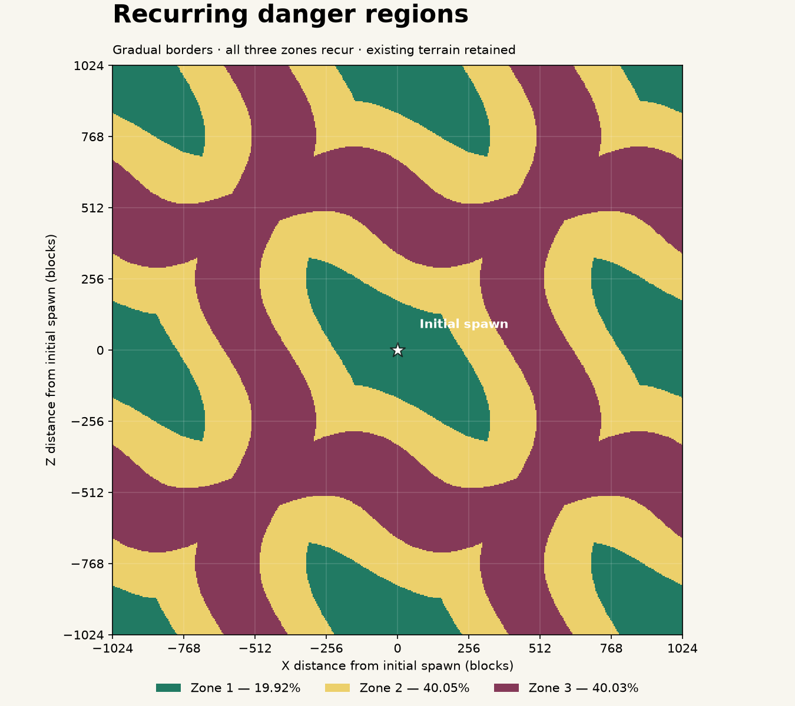
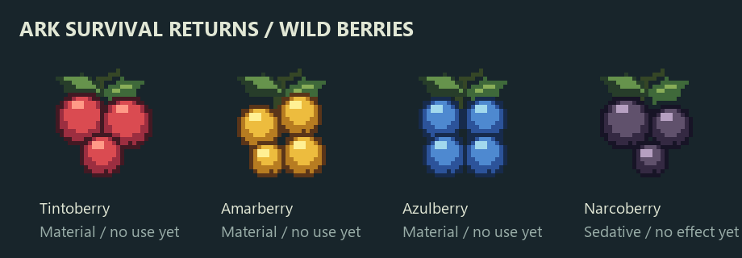

# Ark Survival Returns

A prehistoric wildlife mod for Minecraft Java **26.1.2**, NeoForge **26.1.2.109**, Java **25** and GeckoLib **5.5.2**. Mod ID: `arksurvivalreturns`.

## Play on Windows

**Double-click `Start-Ark-Mod.bat` in the repository root.** It builds the mod and opens Minecraft with NeoForge and GeckoLib loaded. VS Code and a separate Minecraft launcher are not needed. Keep the console open while playing; the first launch may take a few minutes. Startup errors remain visible in the console. The dev client uses a 16 GB maximum heap. The launcher sets the selected Java executables to Windows high-performance GPU preference for the NVIDIA adapter.

PowerShell alternative: `.\Start-Ark-Mod.ps1`. The launcher finds JDK 25 through `JAVA_HOME`, JBang or `PATH`, and uses the project Gradle wrapper. Its execution-policy override applies only to its own process. `Start-Ark-Mod.bat -Check` builds and prepares the client without opening the game.

## Playable systems

- **Debug Spyglass:** hold use while aiming at a dinosaur for a green terminal inspector of live stats, AI/flight variables and saved data. Scroll to page through values. Obtain it from the Ark creative tab or `/give @s arksurvivalreturns:debug_spyglass`. See [controls and limits](docs/debug-spyglass.md).
- **Taming, torpor and riding:** every one of the 41 registered creatures has a taming profile and a measured rider seat. Feed berries, plants, raw meat or fish to a willing creature, or knock a large or dangerous one out with narcoberries and tranquilizer arrows and feed it from its own inventory. Tame it, saddle it with the saddle of its own species (stitched at the Saddlery, at a level that grows with the animal) and ride it. Tribe members can be granted riding, cargo and order permissions with `/arktribe`. See [the roster and seat manifest](docs/taming-roster.md) and [the debugging guide](docs/taming-debugging.md).
- **Journal and tribes:** press **J** to open the tribe's shared quest journal. FTB Teams is the tribe: create a party with `/ftbteams`, invite your partner, and work through the Primitive and Camp and Recovery chapters together. See [the journal and tribe stack](docs/journal-tribe.md).
- **Camp and rescue:** plant fiber drops from grass, the primitive bedroll sets a respawn point that survives the block, and a hit that would kill leaves you downed for a minute instead of dead — a tribe member revives you with a fiber bandage. `[camp]` and `[downed]` settings tune it. See [camp and rescue](docs/recovery.md).
- **Keratin tier:** horned, plated and beaked creatures (and goats) drop keratin for the first armour set and the Keratin Spear, a vanilla spear with a Better Combat two-handed stab. A Sharp Rock, knapped from two rocks, tips arrows in place of flint.
- **Weight and working tames:** survivors and tames now haul a measured load. The HUD shows the load and warns before it matters; only past 100% does sprint lock and movement slow, and slot moves are never blocked. Craft a pack or reinforced harness to unlock a species' cargo capacity, then use the tame screen's Load/Unload buttons to move goods to nearby storage. Overloaded flyers refuse to take off and descend in control, overloaded swimmers cannot dive and surface before the rider drowns, and a Triceratops or Ankylosaurus given the WORK order forages or mines inside a bounded, supervised job site — never touching player-built blocks. See [weight and working tames](docs/weight-and-work.md).
- **Cozy camp art:** a sage canvas bedroll with a rolled carry model, resin-sealed troughs in ten woods, stackable racks with visible drying food, and a cooking pot on a campfire trivet. See the [model collection](docs/camp-assets.png) and [crafting details](docs/homestead.md).
- **Homestead economy:** plant the four Ark berries into renewable bushes, feed your tames from a trough, dry raw food into portable rations, and cook hearty stew or trail mix in the cooking pot. Minecraft furnaces handle smelting, while ordinary chests and barrels accept tame Load/Unload transfers until the planned Tom's Storage integration. See [homestead economy](docs/homestead.md).

The launcher also loads the pinned gameplay stack — FTB Quests, FTB Teams, FTB Library, FTB XMod Compat and JEI — plus the optional client pack: Xaero World Map with the difficulty overlay, Sodium and Iris. AmbientSounds, footsteps and Sound Physics are integrated directly into Ark Survival Returns rather than loaded as standalone mods. Bliss 2.1.2 is the default for new instances, with a prehistoric atmosphere preset; Complementary Reimagined remains available as a fallback. Run `../Install-Ark-Extras.ps1 -ResetShaderPreset` to back up and apply Bliss to an existing instance. Taming a creature from a difficulty-5 region unlocks the map; while `progression.mapRequiresUnlock=false` (the default) everyone sees it without the entitlement. See [installation, versions and map controls](docs/client-pack.md) and [the journal and tribe stack](docs/journal-tribe.md).

- Forty-one species using the supplied models, original palette textures and 298 movement, attack, water and behavioral clips. Runtime copies are normalized to entity height; original projects remain in `../Creatures`. A renderer correction aligns the imported +Z-facing skeletons with forward entity movement.
- Replenished natural groups across Overworld biomes, solitary large creatures, terrain checks, population limits and spacing.
- Three recurring danger zones, persistent random creature levels, independently scaled HP/damage and biome-entry chat messages.
- Look at a creature within 32 blocks for its name, level and current/max HP in a boss-style bar. Walls block targeting. Players have independent bars; predators are red and other creatures green.
- Four complete berry items, textures, inventory models, English/Portuguese names and grass loot integration; forty-one matching spawn eggs in the Ark creative tab.
- Ten additional land creatures share existing behavior families, including timid small-herbivore herds. See [the expansion mapping and limitations](docs/creature-expansion.md).
- Twenty-two collection creatures add water, swamp, cold and flying realms: saved home pools for six water species, semi-aquatic shorelines that switch to swim clips, snow-supported hydration for the cold six, three more nest colonies and a solo apex flyer that guards its roost. See [the collection ecosystem](docs/collection-ecosystem.md).

## Beacon monolith guardian

New Overworld terrain can generate beacon monoliths roughly 500 blocks apart: overgrown stone pillars
up to 100 blocks tall that hang just above the ground. A red, white or black dragon nests in the eye
of each, beside a loot crate, and defends it automatically; no Allosaur Heart is needed.
Defeat it to earn the Workshop Schematic. Use /locate structure arksurvivalreturns:sky_beacon to
find one. See [beacon rules, variants and verification limits](docs/first-guardian.md).

## Theme alignment

Wildlife survival is the game; Minecraft's fantasy and alternate-dimension content is not. The patch removes that content and keeps the mundane materials a survivor still needs.

- The **Nether and the End** cannot be entered: portals cannot be lit, every dimension change is cancelled, and `allow_entering_nether_using_portals` is forced off. Ruined portals, strongholds, end cities, fortresses and bastions no longer generate. A character saved inside either dimension is returned to safe Overworld ground on join and on respawn; dimension ids and saved data are untouched.
- Fantasy hostiles are gone, including every variant of this version: zombies, drowned, husks, zombie villagers and zombies' aquatic, camel and horse forms; skeletons, strays, bogged, parched and wither skeletons; creepers; endermen, endermites, shulkers and the Ender Dragon; witches and all illagers with their vexes and ravagers; phantoms; slimes, magma cubes and sulfur cubes; guardians; blazes, breezes and ghasts; piglins, hoglins and zoglins; wardens and the creaking; silverfish; cave spiders; iron, snow and copper golems; and the Wither. Ordinary spiders, all ordinary animals, villagers and every mod creature stay.
- Enchanting, brewing and potions, teleportation items, totems, soul items, beacons, conduits, respawn anchors, ender chests, elytra, sculk gameplay and fantasy progression tiers such as netherite are removed, including from existing inventories and worlds.
- Monster rooms, trial chambers, ancient cities, woodland mansions, pillager outposts, witch huts and ocean monuments no longer generate, and raids, patrols, sieges and phantom flybys cannot start. Villages, mineshafts, ocean ruins, shipwrecks, temples and trail ruins keep generating.
- Farm animals are gone too: cows, mooshrooms, pigs, sheep, chickens, horses, donkeys and mules do not spawn, are not placed in villages and are removed from loaded chunks. Dinosaur carcasses supply the meat, hide (the renamed leather), feathers and bone, and the favourite taming foods are dinosaur meats. Goats, rabbits, llamas and the wild animals stay. Eggs have no source left.
- Bones now come from animal carcasses (15 vanilla animals, 1–2 at 75%), so bone meal and wolf taming survive the skeletons. Gunpowder and slime balls keep the wandering trader as their grounded source; string, leather, feathers and wool were never at risk. See [the removal decisions, retained sources and limitations](docs/theme-alignment.md).

## Spawn rules

Ark wildlife is placed by one population budget and is in no vanilla spawn list, so the same rules hold in freshly generated and in long-visited land. The land is divided into **biome regions** (`spawning.populationModel = BIOME`): each tile of 32 by 32 chunks falls into the connected patches of one biome, read from the world's own biome layout without loading a chunk, and a patch under 16 chunks or too thin to enclose one (a beach between the sea and a plain) belongs to the largest patch beside it. A region has room for a quota of groups (a herd, a pack, a pair or a lone animal) of each class: its chunks times the density of **10 groups within 128 blocks** (`spawning.wildGroupsPerPlayer`, a group every 70 blocks or so), shared out as 65 % plant eaters, 20 % hunters, 5 % giants and 10 % flyers on land, and all sea animals in the sea; a class that does not live in the biome gets none. The classes and their shares are a first cut.

Every **5 seconds** the budget looks at the loaded chunks around each player. A chunk seen for the first time is surveyed (height, open ground, water) and **settled once**: it gets its share of its region's groups, drawn from the world's seed, while the region is below its quota. After that a region below a quota takes groups in **over days**: its whole quota in `spawning.populationRefillDays` (4 game days), never more than it is short of, each in a chunk nobody watches, so hunted land stays thinned for a while. Nothing is placed around a player for being there, never closer than 32 blocks, and nothing is removed. `/arkwildlife land` prints the region a player stands in: what its chunks showed and its groups against its quotas. The earlier models stay for comparison: `LEDGER` keeps about ten groups around each player, scaled by a regional predator-prey ledger, half of them ahead of a walking player; `BUDGET` a fixed number of animals. Searches have a fixed attempt budget and never request chunks. The `minecraft:spawn_mobs` game rule and the mod's spawning toggle disable it.

Wildlife is met the way livestock is in the vanilla game:

- A group is **1 to 5 animals** (see the table) and is placed at the size it rolled: each member gets eight tries around the anchor, so trees and slopes do not thin a herd to one animal. Predators are fewer than what they eat.
- Groups are placed **40 blocks** apart, and a hunter never within **48 blocks** of another group, so nothing is born into a chase. A species that does not fit where the site fell (a Triceratops among trees) looks for open ground within 12 blocks before the site is given up.
- A species does not repeat within **64 blocks** of itself.
- **About a quarter of the groups** around a player are land hunters, by day and by night, wherever a hunter of the zone lives: the second, sixth and tenth group are theirs and the others go to the plant eaters. At most **two** groups are flyers and **one** is an apex animal. Where the danger zone allows a giant the budget tries for one, never for the whole list.
- Every kind of land holds at least two plant eaters of zone 1, so no starting country is empty.
- **An animal lives until it dies.** Every wild animal is on a saved register from the moment it joins the world (who, pack, level, where it was last known, when it appeared) and leaves it only with an end on record: the day, the place and the cause of its death, a taming, or a removal. `/arkwildlife register` prints the living and the latest ends. An animal the server has sent to a client is never deleted, and no creature despawns the vanilla way; above its targets the budget only stops placing. A spare group can still be removed whole, at most two per check and beyond 56 blocks from every player, only while no client was ever sent any of its members.
- **Beyond the loaded land an animal lives on as a record** (`spawning.silentLife`). An animal whose chunk is not loaded takes no server time; the records of each biome region live a **round of cheap rules** instead, once a game day (`spawning.silentRoundDays`) and **four times as often** in a region where players have stayed a game day in all (`spawning.silentLivedInRounds`). In a round an animal past its span dies of **age**: a species lives `spawning.wildLifespanDays` (60) × (0.5 + base HP / 100) game days, each animal a quarter to five quarters of that after it appeared. Plant eaters **feed** where they stand and hunters grow hungry. A hungry pack is **matched by odds** against one plant-eater group of its region (a giant among hunters also against lesser hunters): its strength over the strength of both, strength being health × damage of every member at its level. It kills the weakest of the prey and is fed, or it fails, and prey that stands its ground may kill one of the pack; a pack that goes on starving loses a member. A fed group of two or more below the size of its species gains a **young** with odds of 25 %, halved in a region without surface water and lowered by the hunters' share of the region's groups. And the group **shifts** up to 8 blocks. No record leaves its chunk or its region, and flyers keep their place; only groups with no member loaded and none being tamed, ridden or led take part. **As a chunk loads** its animals are what their records are: a body is moved to its record's place where it can stand there unseen and takes its hunger, a young born meanwhile appears (full-grown: there is no young form), and an animal that died there is not loaded. Those ends are on the register with their cause (`age`, `starved` or the killer's species); `/arkwildlife land` prints how long players have stayed in the region and the pace of its rounds.
- **The rounds can be lived through without the game.** `python tools/existence_check.py`, and the Behaviour page of the showcase, run the register of 14 sample biome regions for years (`tools/existence_model.js`) under the rounds above and under a proposed bounded model (`design/existence/model.json`, not in the game: every daily odd follows the pressure of a kind of eater, its appetite over its food), and say whether each region stays bounded, keeps its classes and settles.
- **What becomes of the land a player leaves can be recorded.** The session recorder follows the register beside the bodies (a roll call at the start, at each mark and at the end, a count every ten seconds, every end, silent birth, round and body brought back to its record), and `python tools/session_bench.py --setups full --path return --record --config spawning.silentRoundDays=0.05` flies the real client out and back over the benchmark world: a minute at a place 768 blocks from the start, a flight until it is beyond the loaded land, 150 seconds away, the return. `python tools/session_existence.py` then says of every animal of the place whether it is alive under its own record, has an end on record or is missing; the last fails the verdict.
- **Nothing appears or vanishes while somebody watches** (`spawning.populationOutOfSight`). An animal is in plain sight of a player when it stands within the 12 chunks creatures are shown at, within 80° of where they look, at least 0.75° across (a block-tall animal within 76 blocks, a two-block one within 153) and with a clear line from their eye to its feet, middle, head or flanks; ground, walls and foliage block the line. Every member of a group is placed, and a spare group removed, only where no player has it in plain sight: behind them, behind a hill or a wood, or as a speck in the distance. On bare open ground the land ahead of a player therefore fills from the sides and from behind.

**Where a species lives** is its range: the kinds of surface biome that suit it, each biome classified from its own tags, so modded biomes are covered. Grazers keep to open ground, browsers and ambushers to the trees, crocodilians to the banks, runners to dry scrub, fishers to the coast. Warm species keep out of the snow, the basking reptiles and Pteranodons also out of cold climates, and the cold species need snow or a cold climate. Caves, mushroom fields, sky islands and biomes of unknown type hold no Ark wildlife. The danger zone of the area still decides which residents may appear. A data pack adds a biome to a species with the tag `arksurvivalreturns:spawns/<species>`, or reclassifies a biome with `arksurvivalreturns:ecology/<type>`. `/arkwildlife` prints the biome's kind and who its range holds.

Placement requires a supported footprint, collision-free space (foliage may cross a large body) and the world border. Land carnivores are placed by day as well; they walk to tree canopy to sleep and stay awake where there is none. Flyers additionally need their nest site: shoreline sand for Pteranodon, a floor at Y≥96 for Argentavis, Y≥110 for Quetzal, forest ground for Archaeopteryx and high peaks for the Dragon. Water species need a loaded pool of connected deep water, semi-aquatic species a bank next to exposed water, and cold species accept snow cover or ice over water as their drink source. There is no natural spawning in the Nether or the End.

| Species | Group | Weight | First danger zone | Base HP | Base damage | Hunter | Range |
|---|---:|---:|---:|---:|---:|---|---|
| Pteranodon | 1–3 | 10 | 1 | 24 | 3 |  | River, coast |
| Velociraptor | 2–3 | 8 | 2 | 32 | 5 | yes | Savanna, shrubland, desert, badlands |
| Argentavis | 1–2 | 4 | 2 | 46 | 6 |  | Savanna, shrubland, desert, badlands, mountain |
| Triceratops | 2–4 | 12 | 1 | 85 | 8 |  | Grassland, savanna, shrubland, forest, wetland |
| Therizinosaurus | 1–2 | 6 | 2 | 100 | 10 |  | Forest, taiga, jungle |
| Brontosaurus | 1–3 | 6 | 3 | 145 | 12 |  | Grassland, savanna, forest |
| Tyrannosaurus | 1 | 4 | 3 | 130 | 14 | yes | Grassland, savanna, forest, taiga |
| Giganotosaurus | 1 | 2 | 3 | 170 | 17 | yes | Grassland, savanna, shrubland, desert, badlands |
| Titanosaur | 1 | 2 | 3 | 190 | 20 |  | Grassland, savanna, shrubland |
| Spinosaurus | 1 | 3 | 3 | 125 | 13 | yes | Jungle, wetland, river, coast |
| Parasaur | 3–5 | 14 | 1 | 48 | 3 |  | Grassland, savanna, forest, taiga, jungle, wetland, river, coast |
| Ceratosaurus | 1 | 4 | 2 | 88 | 10 | yes | Forest, jungle, wetland, river |
| Dilophosaur | 1–3 | 8 | 1 | 22 | 3 | yes | Forest, jungle, wetland |
| Acrocanthosaurus | 1 | 2 | 3 | 155 | 16 | yes | Savanna, forest, wetland |
| Allosaurus | 1–3 | 5 | 2 | 78 | 9 | yes | Savanna, shrubland, forest, badlands |
| Ankylosaurus | 1–3 | 8 | 2 | 95 | 9 |  | Grassland, shrubland, taiga, badlands, mountain |
| Carnotaurus | 1 | 5 | 2 | 82 | 10 | yes | Grassland, savanna, shrubland, desert, badlands |
| Pegomastax | 2–4 | 12 | 1 | 18 | 2 |  | Shrubland, forest, taiga, jungle, mountain, desert, badlands |
| Lystrosaurus | 2–4 | 12 | 1 | 20 | 2 |  | Savanna, shrubland, coast, desert, badlands, mountain, volcanic, geothermal |
| Cnidaria | 1 | 8 | 1 | 12 | 2 |  | Ocean |
| Plesiosaur | 1 | 8 | 2 | 60 | 6 | yes | Ocean |
| Megalodon | 1 | 7 | 2 | 90 | 12 | yes | Ocean |
| Liopleurodon | 1 | 5 | 2 | 80 | 11 | yes | Ocean |
| Mosasaurus | 1 | 3 | 3 | 160 | 18 | yes | Ocean |
| Tusoteuthis | 1 | 3 | 3 | 150 | 16 | yes | Ocean |
| Kaprosuchus | 1 | 5 | 2 | 55 | 8 | yes | Jungle, wetland, river |
| Sarco | 1–2 | 6 | 2 | 70 | 10 | yes | Wetland, river, coast |
| Deinosuchus | 1 | 3 | 2 | 120 | 14 | yes | Wetland, river, coast |
| Titanoboa | 1 | 4 | 2 | 45 | 9 | yes | Jungle, wetland |
| Megalocerus | 3–5 | 12 | 1 | 60 | 6 |  | Grassland, shrubland, forest, taiga, wetland, river, badlands, mountain, tundra |
| Unicorn | 1 | 3 | 1 | 65 | 7 |  | Grassland, forest, tundra |
| Mammoth | 2–4 | 7 | 2 | 140 | 12 |  | Shrubland, taiga, wetland, coast, tundra (snow only) |
| Direwolf | 3–4 | 6 | 2 | 50 | 8 | yes | Shrubland, forest, taiga, badlands, mountain, tundra |
| Sabertooth | 1–2 | 4 | 2 | 60 | 11 | yes | Taiga, mountain, tundra (snow only) |
| Megapithecus | 1 | 1 | 3 | 180 | 18 | yes | Taiga, mountain (snow only) |
| Paraceratherium | 1–3 | 5 | 2 | 155 | 13 |  | Grassland, savanna, shrubland |
| Terrorbird | 1–2 | 5 | 2 | 45 | 9 | yes | Grassland, savanna, shrubland |
| Ravager | 2–3 | 4 | 2 | 65 | 11 | yes | Taiga, badlands, mountain, volcanic, geothermal |
| Archaeopteryx | 2–3 | 8 | 1 | 10 | 2 |  | Forest, taiga, jungle |
| Quetzal | 1 | 2 | 3 | 130 | 10 |  | Grassland, savanna, desert, mountain |
| Dragon | 1 | 1 | 3 | 190 | 22 | yes | Badlands, mountain, volcanic |

Members of a small group share a saved pack identity. Land followers seek their pack's leading member when separated; combat takes precedence. Flyers share a habitat but use independent flight paths and perches. Separate packs do not merge. Raptors, Rex and Giga hunt non-creative players with line of sight outside Peaceful; land herbivores defend themselves. Flyers attack players only after an egg is taken or an egg-bearing nest is broken. Natural wildlife may despawn at vanilla distances. Named and spawn-egg creatures persist.

## Difficulty and levels

Difficulty is an overlay on existing Minecraft terrain. Three zones recur in curved regions; no permanent deadly exterior remains. At the default scale, the pattern repeats every 1,024 blocks in X and Z: zone 1 holds about **20% of the area**, zones 2 and 3 about **40% each** (the former ranks 2-3 and 4-5, merged). The measured complete-tile shares are 19.92% / 40.05% / 40.03%; block-grid rounding causes the small difference from exact fifths.

Neighboring and diagonal blocks cannot skip zones, including at tile seams. The initial world-spawn region remains zone 1. The same biome type can lie in different zones in different places.



| Zone | Wild levels | Newly eligible species |
|---|---:|---|
| 1 — Easy | 1–12 | Pteranodon, Triceratops |
| 2 — Dangerous | 8–50 | Velociraptor, Argentavis, Therizinosaurus |
| 3 — Deadly | 32–80 | Tyrannosaurus, Brontosaurus, Giganotosaurus, Titanosaur |

Earlier species remain eligible in later zones. **The displayed zone is authoritative:** zone-3 plains can spawn an apex. The old hidden easy-biome tag prohibition was removed. Rex, Giga and Titanosaur require zone 3, so zone 1 remains protected. Existing or manually placed creatures can wander across borders.

Chat announces biome name, zone and wild level range when entering a different biome or zone. Checks occur once per second with two stable readings after a crossing. Other dimensions display an unrated message.

Existing worlds adopt the new pattern immediately using their saved origin and scale; no terrain regeneration is needed. Creature levels are not rerolled. The legacy config key `progression.bandWidth` now controls region scale: tile period = four times that value. The scale is saved per world. Beds, commands and later `/setworldspawn` changes do not move the saved pattern or override chosen respawn locations.

Level is a uniform integer roll, once per creature, from its spawn location's danger range. Crossing a border never rerolls it. Reversed configured level endpoints are sorted; supported levels are 1–100.

Let `n = level - 1`:

```text
max HP = min(1024, base HP × (1 + 0.10 × n^0.85))
melee damage = base damage × (1 + 0.14 × sqrt(n))
```

At level 40, HP is about 3.25× and damage about 1.87×. The formulas are independently chosen for this mod. Values are vanilla HP/damage points (2 points = one heart); armor and difficulty mechanics still apply. The 1024 ceiling respects Minecraft's health attribute limit.

Level, pack identity, natural-spawn status, current HP and scaled attributes survive saves. Growth changes affect newly spawned creatures; existing creatures keep saved stats and are never healed by reloading.

## Size, speed and behavior

| Species | Size multiplier | New body width × height |
|---|---:|---:|
| Titanosaur | 6× | 30 × 42 blocks |
| Giganotosaurus | 3× | 10.5 × 15 |
| Tyrannosaurus | 3× | 8.4 × 13.5 |
| Therizinosaurus | 2× | 3.6 × 6 |
| Brontosaurus | 2× | 8 × 11 |
| Triceratops | 2× | 5 × 5 |
| Argentavis | 2× | 2.4 × 3.2 |
| Velociraptor | 2× | 1.7 × 3 |
| Pteranodon | 2× | 1.8 × 2.4 |

Movement uses per-species player-relative sprint targets, including existing saved creatures. Animation cadence follows actual distance traveled, clip length and body size. See [movement tuning](docs/movement-tuning.md). Meshes, animation position tracks, collision bodies and eye heights scale together. HP and damage balance are unchanged. Large creatures need correspondingly large clear areas.

The land behavior model adds roaming, foraging, seeking water, drinking, resting, alertness, investigation, warnings, hunting, defense, fleeing, returning home and feeding. Hunger/thirst/fatigue and home positions persist. Individual routine timing varies. Flying species bypass land needs and sensing; their preserved legacy need values are inactive.

Sight uses facing, range and occlusion. Sneaking, darkness and rain reduce visibility. Movement and action sounds can be heard; wind carries scent, reduced while wet. A hidden target's last-known position can be investigated, but it cannot be attacked through cover. Same-pack alarms communicate locations without granting a shared visible target.

Hungry predators hunt suitable wildlife as well as Survival players. They warn before unprovoked aggression, become satiated after a wildlife kill, and abandon excessive or repeatedly failed chases. Most large herbivores warn/defend when crowded. Critical health and larger predators can cause retreat; a retreat lasts until the threat is out of mind, and an animal struck again on the run, or with nowhere to go, turns and fights (the timid keep running). An animal that is being struck answers first: it neither gives the fight up nor walks home under the blows. Creative/spectator players are never hunted or warned off, but a blow from a creative player is answered like any other for ten seconds; on Peaceful a struck animal runs from the player instead of attacking.

New Bronto herds spawn with a nearby Rex that tracks their home. Healthy Bronto/Trike packs defend attacked members; predators avoid charging defended herds and flee at low health. Flyers come alone or in twos and threes, each with its own nest. Pteranodon circles shoreline sand within 32 blocks; Argentavis circles high-ground nests within 48 blocks. Both occasionally land, perch and take off independently.

The HP bar now includes a behavior label. Calls, startles, feeding and charge clips make transitions visible, with sleeping poses for Rex/Trike. Current audio uses temporary Minecraft cues. Birds now use extracted aerial animations and body pitch. Species audio and terrain IK remain separate work.

See [the research and behavioral specification](docs/behavior-research.md) for the inspected ARK interfaces/assets, game-design sources, complete behavior contract and remaining limitations.

## Flying habitats and eggs

Pteranodon nests are shallow sand bowls near a patch of exposed water (within 12 horizontal blocks and 4 blocks vertically). Argentavis nests have a twig/foliage ring on dry ground with a floor at Y≥96. Each natural colony has 3–4 nest bowls and 3–4 independently moving birds. The thresholds and roaming radii are configurable under `[flying]`; existing biome preferences and danger eligibility still apply.

Right-click a nest to collect its species egg. Breaking a nest containing an egg also provokes its colony. Defenders circle, make staggered swoops at that player, and return home after 30 seconds, leaving a 64-block habitat radius, or losing sight for 3 seconds. They do not target bystanders or become aggressive from ordinary approach, carried eggs, noise or direct damage alone. Creative/spectator players and Peaceful remain excluded from attacks. An unprovoked bird evades damage without retaliating.

Collectible eggs are separate from spawn eggs. They do not hatch or replenish automatically. Empty nest bowls remain, including across saves. Existing habitats are reused when birds replenish; surviving members count toward the 3–4 limit. No offscreen simulation or forced chunk loading is added. Existing wild birds can adopt nearby suitable loaded habitats; named and manually spawned birds do not create nests in player builds.

Xaero's installed fullscreen World Map shows one nest glyph per discovered habitat, with a separate **Nests: on/off** toggle and a hover label with species/coordinates. Discoveries persist per player and dimension, respect map access/exploration, and synchronize as bounded snapshots. This integration does not add minimap markers. See [implementation and validation](docs/flying-ecosystem.md).

## Berries

Breaking **short grass or tall grass** without shears has a **35%** chance to drop **1–2 berries of one type**, in addition to vanilla loot. Relative weights are 30 Redberry / 30 Yellowberry / 30 Blueberry / 10 Blackberry (sedative). The item ids keep the old names (tintoberry, amarberry, azulberry, narcoberry) so existing worlds load.

The upper half of tall grass does not make a second roll. Grass blocks, ferns, sheared grass and creative breaking do not yield bonuses. Explosions use vanilla survival filtering. Redberry, Yellowberry and Blueberry are taming food; the Blueberry also restores one hunger point and heals a hurt tame it is fed to. The Blackberry is a sedative that can be eaten or swung, and the Mortar & Pestle grinds it into Narcotics.

## Taming, torpor and riding

Every one of the 41 registered creatures can be tamed and ridden. Feeding while awake tames ordinary animals and small herbivores; large or dangerous creatures must be knocked out first and fed from their own inventory; flying creatures take fish when they are hungry. Sedation applies to creatures, players and ordinary vanilla animals through one server-authoritative system.

- **Sedatives.** Narcoberries can be eaten (which sedates the user), swung at a creature, or ground into Narcotics, which tip tranquilizer arrows (four arrows, Narcotics and one bone). Torpor is a normalized meter with size-dependent ceilings of 60/150/350/700, a ten second recovery delay and 0.5% recovery per second; an entity wakes below 20% of its maximum.
- **Taming.** Progress comes from meals, never from waiting. A profile's target duration and the twenty second feeding interval derive the progress each meal is worth, and a species' favourite food is worth 1.5×. Damage during an attempt costs ten points, and waking early abandons the attempt while keeping the deposited food.
- **Riding.** Tame it, put the saddle of its species in its saddle slot (no other saddle fits), then use it to mount. Flying creatures climb and dive with the look direction; swimmers steer in three dimensions. Sneak-use opens the vanilla horse-style inventory, which also serves as the knock-out taming screen.

Balance defaults, the complete roster, per-meal progress and the measured rider seat of every creature are in [the taming roster](docs/taming-roster.md). Operator diagnostics and the automated verification matrix are in [the debugging guide](docs/taming-debugging.md).

Drops use NeoForge's additive loot modifier, preserving vanilla seeds. Edit the `gameplay/grass_berries` loot table in a data pack to tune probability, weights or quantities. The `berries` and `sedative_berries` item tags identify materials without giving effects.



## Configuration

The server config is generated at `<instance>/config/arksurvivalreturns-server.toml` on first world load. A file at `<world>/serverconfig/arksurvivalreturns-server.toml` overrides it for that world. The development launcher's instance is `Ark/run`.

Settings cover the group target, check interval/budget, species weights, population cap, large-creature spacing, band width, tier level ranges, HP/damage growth, biome messages and target bar/range. The default example is `config/arksurvivalreturns-server.toml`. Existing values are retained when new keys are added.

Data-pack paths in namespace `arksurvivalreturns`:

- `tags/worldgen/biome/difficulty/*.json`: legacy metadata only; displayed regional danger now determines eligibility for every biome.
- `tags/worldgen/biome/spawns/<species>.json`: preferred habitats; selection weight multiplied by three. Base weights live in the server config.
- `tags/block/spawn_surfaces.json`: eligible terrain, including grass, dirt, podzol, mycelium, sand, stone, terracotta, mud, moss, snow and ice.
- `loot_modifiers/grass_berries.json` and `loot_table/gameplay/grass_berries.json`: berry harvesting.
- `loot_modifiers/animal_bones.json` and `loot_table/gameplay/animal_bones.json`: bones from animal carcasses.
- `tags/entity_type/theme/removed.json` and `tags/worldgen/biome/theme/all_dimensions.json`: the removed creature set and every vanilla dimension, used by the generated biome modifiers.
- `neoforge/biome_modifier/remove_fantasy_spawns.json` and `remove_fantasy_features.json`: spawn lists and features cleaned for new terrain.
- `data/minecraft/worldgen/structure_set/*.json`, `data/minecraft/tags/villager_trade/**`: emptied structure sets and filtered trades. These override vanilla files and are generated by `ArkData`. The vanilla advancement tabs are not loaded at all (`ThemePolicy.removedAdvancement`); only the recipe unlocks stay.

The `theme` server config section (`dimensions`, `monsters`, `mechanics`, all default `true`) switches the runtime guards off for debugging. The generated data removals stay in place whatever the section says.

Use `/reload` for loot and tags. Edit `datagen/ArkData.java`, then run data generation; never hand-edit `src/generated/resources`. Group sizes and minimum danger levels are in `feature/creature/Species.java`.

## Build and verification

Use the included Gradle wrapper with Java 25, from `Ark`:

```powershell
$env:JAVA_HOME = 'C:/Users/Nez/.jbang/cache/jdks/25'
./gradlew.bat runData
./gradlew.bat build
./gradlew.bat runGameTestServer
```

Run data generation before the build in a separate Gradle invocation so the build packages newly generated resources. The resulting JAR is `build/libs/arksurvivalreturns-0.1.0.jar`. Install it alongside GeckoLib 5.5.2 on matching NeoForge 26.1.2.

Fifty-two JUnit tests cover growth curves, recurring danger regions, behavioral decisions, tribe flags, mass thresholds and the work flag, recovery cap folding, downed lethality and map raster correspondence. Fifty-five headless GameTests cover all species' save/load behavior, pack identity, actual combat damage, surface restrictions, population replenishment, saved progression, announcement transitions, map entitlement persistence/player isolation, the rank-5 tame unlock, tribe permissions, journal chapter loading, the starter kit, the bedroll contract, recovery collection and cap folding, the downed revive, packet codecs, unloaded-chunk safeguards, water pool validation and containment, realm/group/clip invariants for all 41 species, the fiber and berry grass drops, the cold hydration policy, mass accounting and band effects, harness gating, ceiling-limited cargo transfer, flight and swim overload, the work-job yields, placed-block protection and supervision gates, trough feeding, drying cycles, bush harvest, meal recipes, kiln and forge batches, and the crate's 27-slot save round trip. See `docs/verification.md`.

Asset rebuild (Python 3.12, Pillow for sprites):

```powershell
python tools/import_creatures.py
python tools/build_item_assets.py
python tools/build_creature_eggs.py
python tools/build_test_structure.py
python tools/verify_assets.py
```

`docs/creature-import.json` records source hashes, scale factors and selected clips. Imported models retain the original skeleton and palette. Body and animation position tracks are scaled together. Collision covers body mass; tails and wings extend beyond it.

## Playtest checklist

1. Restart the client through the launch script. Inspect each species' forward-facing walk and attack, feet, scale, UVs and animation transitions.
2. On dry open land, wait 15–30 seconds and check complete small groups and isolated large creatures.
3. Travel through danger regions and check that higher danger eventually returns to lower danger. Check chat, wild levels, and level-1 apex protection.
4. Look at creatures, damage them, change targets and look through walls. Save/reload an injured creature. Repeat with two players for independent HP bars.
5. Break short/tall grass; check four berry types and normal shearing.
6. Test predator damage in Survival; Peaceful and creative players should not trigger hunting.
7. Swim into a deep pool and watch a water species patrol it, hunt at night and stay submerged; a stranded one sinks back rather than floating.
8. Walk a swamp bank and check that Sarco basks in its 2–3 group and switches to swim clips in the water.
9. Visit a snowfield and check cold hydration, snow browsing and the Direwolf/Mammoth/Sabertooth group sizes.
10. Find a Quetzal or Dragon roost, check the nest and egg, and confirm the apex flyer guards its airspace without chasing beyond the habitat leash.
11. Feed a Lystrosaurus berries and watch the taming progress; then check that it ignores food while full and refuses non-food without consuming it.
12. Shoot a Triceratops with tranquilizer arrows, use it to open its inventory, deposit carrots and watch the meals. Attacking it should cost progress, and letting it wake should reset the attempt while keeping the food.
13. Tame a Pteranodon with fish, saddle it and fly it: climbing and diving follow the look direction, and it must never hover while unconscious.
14. Ride every species once and confirm the seat, the rider facing and that no species stays in its idle clip while moving. The seat manifest lists which species are clamped into the hitbox because their mesh is not normalised.

This pass includes the **ground wildlife behavioral model** for every species plus the water, swamp, cold and flying realms. Taming, torpor, riding and the horse-style creature inventory are implemented in the same release; see [the taming roster](docs/taming-roster.md). Breeding, territory ecology, custom dinosaur audio, experience gain and creature harvesting are separate future systems. Visual movement, seat placement and encounter balance still require in-client playtesting; automated checks do not launch an interactive client.
