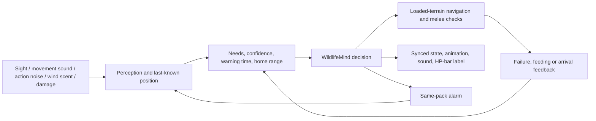

# Wildlife behavior: research and implemented model

Research and implementation: 6 September 2026. Minecraft 26.2 / NeoForge 26.2.0.11-beta / GeckoLib 5.5.3.

## Main finding

Immersion needs understandable causes: an animal has somewhere to live, something to do, ways to detect danger, and a readable response. The implemented model separates perception, remembered information, decisions, navigation, and presentation. It recreates selected concepts in Java using our own rules; it does not execute ARK's Unreal Blueprints.

The current ground-wildlife model is implemented in `feature/behavior/`, integrated with every species, persisted, and covered by unit and in-game tests. Flying, taming, reproduction, territory-level population simulation and bespoke dinosaur audio are separate systems, not hidden capabilities of this implementation. Berries remain inert and damage/HP formulas are unchanged.

## What I inspected in the installed ARK files

`tools/inventory_ark_behavior.py` reads the installed ASE 405/10 package name tables without modifying the packages. The resulting [inventory](ark-behavior-inventory.json) contains **213 package records**, source hashes, and all **341 supplied animation names**. All selected packages parsed successfully. These are metadata references, not decoded Blueprint control flow, native method bodies or verified numeric defaults.

Observed assets include `Dino_BT`, `DinoAttack_BT`, `DinoFlee_BT`, `DinoSeek_BT`, flyer attack/flee/seek variants, `ShouldFleeFromAttack_SRV`, `RotateToTarget_SRV`, `IsWithinAttackRangeAndGetBestAttack_SRV`, `MoveAroundBlockade_DR`, `RandomWait_TK`, and species AI-controller Blueprints.

`Dino_AIController_BP` references `BlackboardComponent`, `RunBehaviorTree`, separate attack/flee trees, attack interval/rotation keys and fixed/random wander distances. `Rex_AIController_BP` names include neighbor-alert range, natural targeting range, attack interval/range/rotation and wander distance. This supports a modular design; a name alone does not establish exactly when ARK calls it.

There are **54 runtime clips** now, up from 27: the original idle/walk/attack set plus charges, feeding/grazing, calls/startles, and actual sleeping clips for Rex and Trike. Original source models and clips remain unchanged. Other species rest in their idle pose; torpor animations are not misrepresented as ordinary sleep. Raptor/Rex eating clips are applied additively over idle.

## ARK methods, properties and registration concepts

The ASE Ark Server API project exposes these controller interfaces. It is documentation of its bindings, not Studio Wildcard's complete source or proof that every species uses every hook. [ASE controller reference](https://arkserverapi.wiki/ase/struct_a_primal_dino_a_i_controller.html).

| Exposed interface | Concept recreated here |
|---|---|
| `GetTargetingDesire`, `GetAggroDesirability` | Candidate eligibility, hunger, proximity and current-focus preference |
| `GetAggroNotifyNeighborsRange_Implementation` | Nearby members of the same saved pack receive alarm positions |
| `ForceFleeUnderHealthPercentageField`, `bFleeOnCriticalHealthField` | Low-health retreat; also timid and intimidated animals |
| `GetAttackInterval`, `IsWithinAttackRangeAndCalculateBestAttack` | Separate attack readiness, range and visibility checks |
| `GetRandomWanderDestination` | Bounded, loaded-terrain destinations around a saved home |
| `OnMoveCompleted`, `RecoverMovement`, `MoveAroundBlockade` | Path failure recovery instead of endless pursuit |
| `GetCorpseFoodTarget` | Satiety and a feeding period after a wildlife kill |

ARK's status component exposes food/water consumption, stamina use/recovery, injury and environmental status fields. Our hunger, thirst and fatigue are behavioral needs. They do not copy ARK's stat growth or inflict starvation/dehydration damage. [ASE status component](https://arkserverapi.wiki/ase/struct_u_primal_character_status_component.html).

`ANPCZoneManager` exposes spawn-entry containers, population limits, desired population, iteration limits, floor tests, spawn distances and failure counts. Those are useful precedents for a future ecology director. Our immediate fix remains bounded local pack replenishment; no full territory population simulation was added. [ASE zone manager](https://arkserverapi.wiki/ase/struct_a_n_p_c_zone_manager.html).

“Registration” differs between engines: this mod registers Java entity types and attributes through `ModContent`, attaches a `WildlifeGoal`, and registers server event listeners for noise. ARK's Blueprint classes, blackboard assets and behavior trees are Unreal assets. Modern Wildcard documentation also describes **ASA** plugin creation; that documentation must not be mistaken for ASE implementation details. [Wildcard's ASA mod creation guide](https://devkit.studiowildcard.com/getting-started/creating-new-mods).

## What other games contribute

**Way of the Hunter: predictable reasons to be somewhere.** Its developers describe species-specific eating, drinking and sleeping locations and schedules. That supports routines and home areas instead of perpetual random strolling. Our version uses saved homes, grazing surfaces, local shoreline searches and a different rest schedule for raptors. It does not claim to reproduce their hidden simulation. [Nine Rocks Games FAQ](https://ninerocksgames.com/posts/frequently-asked-questions). Their later Q&A also describes placing need zones and warns that unclear onscreen information can mislead players about sensing. That is why the current HP bar exposes the creature's behavioral state during testing. [Developer Q&A](https://ninerocksgames.com/posts/end-of-the-year-q-and-a).

**theHunter: Call of the Wild: variation within a species.** Its waterfowl developer diary describes species-specific approaches, formations and flee behavior, individual variation, and calls that communicate successful attraction. Our needs and routine pauses vary per individual, while pack identity remains stable. Flight choreography would require a separate movement model. [Waterfowl developer diary](https://callofthewild.thehunter.com/developer-diary-waterfowl-rework/).

**Hunt: Showdown: hear the state change.** Crytek explains distinct ambient/aware/combat voices, escalation cues, distance attenuation and obstruction-aware sound. Our state transitions and footsteps now produce audio cues; action sounds are attenuated through cover before AI hears them. The current voices reuse Minecraft sounds and pitches. They establish feedback but are placeholders for bespoke dinosaur calls. We have not implemented Hunt's full audio propagation or mixing system. [Crytek audio design](https://www.huntshowdown.com/news/hunt-audio-readability-realism-and-consistency).

**Horizon: separate decision systems from movement.** Guerrilla describes mixed-size navigation, group coordination, and combined planning/utility decisions. That is especially relevant to a 28-block Titanosaur. Our small state model uses explicit priorities, memory and hysteresis; it is not an HTN planner. Large-body navigation remains a separate constraint, even when the correct behavior is selected. [Guerrilla's AI presentation](https://www.guerrilla-games.com/read/the-ai-of-horizon-zero-dawn).

**Unreal's architecture: stimuli update memory; actions consume it.** Epic documents sensory stimuli, their aging and perception updates, alongside event-driven behavior trees. Our server model uses bounded periodic sensing plus action events, and stores a last-known point rather than continuously following an unseen target. This is an adaptation, not an assertion that stock Unreal perception reproduces ARK. [Epic perception documentation](https://dev.epicgames.com/documentation/unreal-engine/ai-perception-in-unreal-engine?lang=en-US), [UE4 behavior-tree overview](https://dev.epicgames.com/documentation/en-us/unreal-engine/behavior-tree-overview?application_version=4.27).

**Ground contact is part of behavior presentation.** Wildcard documents ground-conforming rigs, traces and full-body IK. Our converted clips remain skeletal animation without terrain IK. Enlarging a creature makes sliding, foot placement and terrain clearance more noticeable; a future foot-placement layer should modify presentation without changing the authoritative collision body. [Wildcard ground conform](https://devkit.studiowildcard.com/systems-tools/ground-conform/setting-up-ground-conform).

## Implemented behavior contract

| State | Entry and resulting behavior |
|---|---|
| Roam | Local destinations and varied pauses; separated small-pack members regroup |
| Forage | Hungry non-predators graze on grass/podzol/mycelium/moss, not stone; hunger falls gradually |
| Seek water | Thirsty animals search a limited number of loaded shoreline positions; fallback to roaming if none works |
| Drink | Water must actually be nearby; the animal stops and thirst falls |
| Rest | Fatigue or the species' rest period; hysteresis sustains rest until sufficiently recovered |
| Alert | Detection builds confidence; the creature looks toward the perceived stimulus |
| Investigate | A sound, scent, alarm or lost visual contact yields a last-known/approximate location, never permission to attack through cover |
| Threaten | A hungry predator or a territorial animal warns before unprovoked escalation |
| Hunt | Hungry predators pursue eligible wildlife or Survival players; critical injuries, intimidation, home distance and chase limits can stop them |
| Defend | Retaliation against an actual attacker, or an intruder who remains close through the warning period |
| Flee | Timid Pteranodon, critical health, or a substantially larger predator causes movement away from the remembered threat |
| Return home | Territory boundary, excessive pursuit or repeated path failures end the chase |
| Feed | A successful wildlife kill satisfies predator hunger and produces a short feeding period |

The target must be alive, non-spectator and non-creative. Peaceful disables player-directed aggression. Predator prey selection includes smaller suitable wild dinosaurs and vanilla animals; packmates and predators of the same species are not prey. Larger predators can intimidate smaller animals. Most large herbivores defend space; Pteranodon favors escape. Raptors use a nocturnal rest preference. These are authored gameplay profiles, not claims of paleontological certainty or copied ARK defaults.

Sight checks range, facing and a clear ray. Crouching, darkness and rain reduce visibility. Movement noise distinguishes crouching, walking and sprinting. Breaking blocks and attacking emit short-lived action stimuli; walls attenuate those. Scent depends on a shared, slowly changing wind direction and is reduced while wet. Indirect information yields investigation, not an omniscient combat target. Losing a stimulus allows memory to expire.

Warnings require time before unprovoked attacks. A confirmed hit may trigger immediate defense. Injured or timid animals can flee. Pursuit is limited to 15 seconds before recovery, and to a home radius of 48 blocks for pack species or 80 for solitary species. Repeated path failures trigger recovery instead of retrying forever. None of these mechanisms heals creatures or changes attack damage.

Behavior, level and HP remain independent. The current state is synchronized for animation and appended to the HP bar. Needs and home coordinates survive saves. Targets and sensory memory do not survive a reload, avoiding stale entity references. Existing saves adopt the configurable player-relative movement baseline without compounding it; their saved HP, damage, levels and injuries remain intact.

## Bounded simulation and limits

- Decisions run twice per second per animal, staggered by entity ID. Navigation and normal entity motion still run at Minecraft's tick rate.
- Candidate sensing evaluates at most 24 nearby living entities. Action-noise history is capped at 64 entries per dimension and expires after two seconds.
- Routine destination searches use eight candidates; shoreline searches use at most 32 candidates with a ten-second retry interval. All custom terrain reads check loaded chunks. The pinned Minecraft path-navigation region also obtains chunks with `getChunkNow`.
- Alarms address existing members of the same saved pack and carry positions rather than a magical shared combat target. Alarm propagation has a cooldown.
- There is no offscreen ecological simulation, unlimited path searching, forced chunk loading or terrain regeneration.
- Giant colliders and models are both enlarged. A Titanosaur now has a 20-block-wide, 28-block-tall body box. Such an animal cannot fit in ordinary dense woodland. Flat-terrain spawn tests prove valid placement, not reliable encounters on every landscape.
- Birds currently use ground navigation. Custom roars, proper drinking poses, most sleeping poses, turn-in-place/head-aim layers, terrain IK, flight and visible tracks are not implemented by this ground behavior model.

## Difficulty and apex correction

The previous capped radial distance left all distant terrain at level 5. The replacement repeats curved regions and allocates approximately one fifth of each complete tile to each rank. Integer coordinate shears preserve the area distribution; square-area thresholds make the five shares equal in continuous space, with small block-grid rounding differences. Unit tests cover area ratios, recurrence and adjacent/diagonal borders, including tile seams. See [the map](difficulty-map.png) and [measured shares](difficulty-area-shares.json).

The displayed regional rank is now the authority for species eligibility. A plains biome displaying level 5 no longer retains the old hidden apex prohibition. Rex requires 4+, Giga/Titano require 5; none is naturally eligible in level 1. The population budget (`NaturalPopulations`) keeps a configurable wild population around each player. Ordinary species stay inside their biome tag; the regional large species (Titano, Giga, Rex, Bronto, Theri, Spino, Acro) treat the tag as a weight — x3 in their habitat, x1 outside — and the first placement attempt of a pass is biased toward one missing regional large, so an apex remains reachable wherever the rank admits it without a forced spawn. Large bodies accept bounded uneven ground and now need only a clear feet slab with solid-free headroom; leaves may cross a body. The linked Bronto-and-Rex encounter of the previous director is not part of the budget. `/arkwildlife [radius]` reports the danger band, biome, local population and the per-species placement failure tally for operators. No species has a day/night spawn filter.

## Player-facing development priorities after this model

| Priority | Proposed addition | Why it matters |
|---|---|---|
| 1 | Species-specific calls and readable turn/foot contact | Players can identify warning, fear and pursuit before reading a label |
| 2 | A field-guide mode and optional wind indicator | Teach stealth through observable conditions; keep the current numeric HUD available for testing |
| 3 | Persistent territory/need-zone encounter composition | Ensure predators have homes, prey and reliable signs without forcing an apex into every local encounter |
| 4 | Tracks, disturbed plants and finite carcass resources | Let players discover and follow evidence instead of searching empty terrain |
| 5 | Flight and per-species movement planners | Complete Pteranodon/Argentavis behavior and improve large-animal traversal |
| 6 | Player exertion, wetness, cover and equipment interactions | Add meaningful stealth/survival choices; introduce penalties only after the basic encounter loop is tested |

These are proposals from the research, not features claimed in the current build. Damage balancing and berry uses remain deferred as requested.

## Acceptance evidence

The headless suite verifies warning-before-hunt, hearing without combat, memory expiry, critical-health/timid flight, satiety, bounded pursuit, territorial defense, rest schedules, need reduction and malformed-save bounds. An in-game test checks real sight and a stone occluder, live prey selection, a close melee kill, satiety afterward, creative immunity and unchanged loaded-chunk count. Existing tests cover packs, replenishment, all three large apex placements, levels/HP/injuries, loot and save migration. The separate launcher preparation validates client classes; it does not replace a visual playtest.
