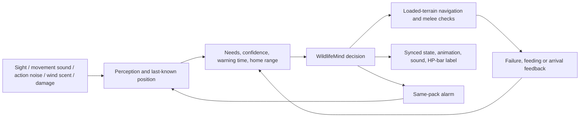

# Wildlife behavior: research and implemented model

Research and implementation: 6 September 2026. Minecraft 26.2 / NeoForge 26.2.0.11-beta / GeckoLib 5.5.3.

## Main finding

Immersion needs understandable causes: an animal has somewhere to live, something to do, ways to detect danger, and a readable response. The implemented model separates perception, remembered information, decisions, navigation, and presentation. It recreates selected concepts in Java using our own rules; it does not execute ARK's Unreal Blueprints.

The current ground-wildlife model is implemented in `feature/behavior/`, integrated with every species, persisted, and covered by unit and in-game tests. Flying, taming, reproduction, territory-level population simulation and bespoke dinosaur audio are separate systems, not hidden capabilities of this implementation. Berries remain inert and damage/HP formulas are unchanged.

## What I inspected in the installed ARK files

`tools/inventory_ark_behavior.py` reads the installed ASE 405/10 package name tables without modifying the packages. The resulting [inventory](ark-behavior-inventory.json) contains **213 package records**, source hashes, and all **341 supplied animation names**. All selected packages parsed successfully. These are metadata references, not decoded Blueprint control flow, native method bodies or verified numeric defaults.

Observed assets include `Dino_BT`, `DinoAttack_BT`, `DinoFlee_BT`, `DinoSeek_BT`, flyer attack/flee/seek variants, `ShouldFleeFromAttack_SRV`, `RotateToTarget_SRV`, `IsWithinAttackRangeAndGetBestAttack_SRV`, `MoveAroundBlockade_DR`, `RandomWait_TK`, and species AI-controller Blueprints.

`Dino_AIController_BP` references `BlackboardComponent`, `RunBehaviorTree`, separate attack/flee trees, attack interval/rotation keys and fixed/random wander distances. `Rex_AIController_BP` names include neighbor-alert range, natural targeting range, attack interval/range/rotation and wander distance. This supports a modular design; a name alone does not establish exactly when ARK calls it.

There are **54 runtime clips** now, up from 27: the original idle/walk/attack set plus charges, feeding/grazing, calls/startles, and actual sleeping clips for Rex and Trike. Original source models and clips remain unchanged. Other species rest in their idle pose; torpor animations are not misrepresented as ordinary sleep. Raptor/Rex eating clips are applied additively over idle.

## ARK methods, properties and registration concepts

The ASE Ark Server API project exposes these controller interfaces. It is documentation of its bindings, not Studio Wildcard's complete source or proof that every species uses every hook. [ASE controller reference](https://arkserverapi.wiki/ase/struct_a_primal_dino_a_i_controller.html).

| Exposed interface | Concept recreated here |
|---|---|
| `GetTargetingDesire`, `GetAggroDesirability` | Candidate eligibility, hunger, proximity and current-focus preference |
| `GetAggroNotifyNeighborsRange_Implementation` | Nearby members of the same saved pack receive alarm positions |
| `ForceFleeUnderHealthPercentageField`, `bFleeOnCriticalHealthField` | Low-health retreat; also timid and intimidated animals |
| `GetAttackInterval`, `IsWithinAttackRangeAndCalculateBestAttack` | Separate attack readiness, range and visibility checks |
| `GetRandomWanderDestination` | Bounded, loaded-terrain destinations around a saved home |
| `OnMoveCompleted`, `RecoverMovement`, `MoveAroundBlockade` | Path failure recovery instead of endless pursuit |
| `GetCorpseFoodTarget` | Satiety and a feeding period after a wildlife kill |

ARK's status component exposes food/water consumption, stamina use/recovery, injury and environmental status fields. Our hunger, thirst and fatigue are behavioral needs. They do not copy ARK's stat growth or inflict starvation/dehydration damage. [ASE status component](https://arkserverapi.wiki/ase/struct_u_primal_character_status_component.html).

`ANPCZoneManager` exposes spawn-entry containers, population limits, desired population, iteration limits, floor tests, spawn distances and failure counts. Those are useful precedents for a future ecology director. Our immediate fix remains bounded local pack replenishment; no full territory population simulation was added. [ASE zone manager](https://arkserverapi.wiki/ase/struct_a_n_p_c_zone_manager.html).

“Registration” differs between engines: this mod registers Java entity types and attributes through `ModContent`, attaches a `WildlifeGoal`, and registers server event listeners for noise. ARK's Blueprint classes, blackboard assets and behavior trees are Unreal assets. Modern Wildcard documentation also describes **ASA** plugin creation; that documentation must not be mistaken for ASE implementation details. [Wildcard's ASA mod creation guide](https://devkit.studiowildcard.com/getting-started/creating-new-mods).

## What other games contribute

**Way of the Hunter: predictable reasons to be somewhere.** Its developers describe species-specific eating, drinking and sleeping locations and schedules. That supports routines and home areas instead of perpetual random strolling. Our version uses saved homes, grazing surfaces, local shoreline searches and a different rest schedule for raptors. It does not claim to reproduce their hidden simulation. [Nine Rocks Games FAQ](https://ninerocksgames.com/posts/frequently-asked-questions). Their later Q&A also describes placing need zones and warns that unclear onscreen information can mislead players about sensing. That is why the current HP bar exposes the creature's behavioral state during testing. [Developer Q&A](https://ninerocksgames.com/posts/end-of-the-year-q-and-a).

**theHunter: Call of the Wild: variation within a species.** Its waterfowl developer diary describes species-specific approaches, formations and flee behavior, individual variation, and calls that communicate successful attraction. Our needs and routine pauses vary per individual, while pack identity remains stable. Flight choreography would require a separate movement model. [Waterfowl developer diary](https://callofthewild.thehunter.com/developer-diary-waterfowl-rework/).

**Hunt: Showdown: hear the state change.** Crytek explains distinct ambient/aware/combat voices, escalation cues, distance attenuation and obstruction-aware sound. Our state transitions and footsteps now produce audio cues; action sounds are attenuated through cover before AI hears them. The current voices reuse Minecraft sounds and pitches. They establish feedback but are placeholders for bespoke dinosaur calls. We have not implemented Hunt's full audio propagation or mixing system. [Crytek audio design](https://www.huntshowdown.com/news/hunt-audio-readability-realism-and-consistency).

**Horizon: separate decision systems from movement.** Guerrilla describes mixed-size navigation, group coordination, and combined planning/utility decisions. That is especially relevant to a 28-block Titanosaur. Our small state model uses explicit priorities, memory and hysteresis; it is not an HTN planner. Large-body navigation remains a separate constraint, even when the correct behavior is selected. [Guerrilla's AI presentation](https://www.guerrilla-games.com/read/the-ai-of-horizon-zero-dawn).

**Unreal's architecture: stimuli update memory; actions consume it.** Epic documents sensory stimuli, their aging and perception updates, alongside event-driven behavior trees. Our server model uses bounded periodic sensing plus action events, and stores a last-known point rather than continuously following an unseen target. This is an adaptation, not an assertion that stock Unreal perception reproduces ARK. [Epic perception documentation](https://dev.epicgames.com/documentation/unreal-engine/ai-perception-in-unreal-engine?lang=en-US), [UE4 behavior-tree overview](https://dev.epicgames.com/documentation/en-us/unreal-engine/behavior-tree-overview?application_version=4.27).

**Ground contact is part of behavior presentation.** Wildcard documents ground-conforming rigs, traces and full-body IK. Our converted clips remain skeletal animation without terrain IK. Enlarging a creature makes sliding, foot placement and terrain clearance more noticeable; a future foot-placement layer should modify presentation without changing the authoritative collision body. [Wildcard ground conform](https://devkit.studiowildcard.com/systems-tools/ground-conform/setting-up-ground-conform).

## Implemented behavior contract

```mermaid
flowchart LR
    A[Sight / movement sound / action noise / wind scent / damage] --> B[Perception and last-known position]
    B --> C[Needs, confidence, warning time, home range]
    C --> D[WildlifeMind decision]
    D --> E[Loaded-terrain navigation and melee checks]
    D --> F[Synced state, animation, sound, HP-bar label]
    D --> G[Same-pack alarm]
    G --> B
    E --> H[Failure, feeding or arrival feedback]
    H --> C
```

| State | Entry and resulting behavior |
|---|---|
| Roam | Local destinations and varied pauses; separated small-pack members regroup |
| Forage | Hungry non-predators graze on grass/podzol/mycelium/moss, not stone; hunger falls gradually |
| Seek water | Thirsty animals search a limited number of loaded shoreline positions; fallback to roaming if none works |
| Drink | Water must actually be nearby; the animal stops and thirst falls |
| Rest | Fatigue or the species' rest period; hysteresis sustains rest until sufficiently recovered |
| Alert | Detection builds confidence; the creature looks toward the perceived stimulus |
| Investigate | A sound, scent, alarm or lost visual contact yields a last-known/approximate location, never permission to attack through cover |
| Threaten | A hungry predator or a territorial animal warns before unprovoked escalation |
| Hunt | Hungry predators pursue eligible wildlife or Survival players; critical injuries, intimidation, home distance and chase limits can stop them |
| Defend | Retaliation against an actual attacker, or an intruder who remains close through the warning period |
| Flee | Timid Pteranodon, critical health, or a substantially larger predator causes movement away from the remembered threat |
| Return home | Territory boundary, excessive pursuit or repeated path failures end the chase |
| Feed | A successful wildlife kill satisfies predator hunger and produces a short feeding period |

The target must be alive, non-spectator and non-creative. Peaceful disables player-directed aggression. Predator prey selection includes smaller suitable wild dinosaurs and vanilla animals; packmates and predators of the same species are not prey. Larger predators can intimidate smaller animals. Most large herbivores defend space; Pteranodon favors escape. Raptors use a nocturnal rest preference. These are authored gameplay profiles, not claims of paleontological certainty or copied ARK defaults.

Sight checks range, facing and physical occlusion. Land creatures first check the central eye ray, then up to eight alternate rays from offsets within their body to the target's head and shoulders. Each offset must be reachable from the central eye without crossing a block; solid terrain and leaves still obstruct the rays. Sensing and melee use the same sight geometry. Crouching, darkness and rain reduce visibility. Movement noise distinguishes crouching, walking and sprinting, using the server's accepted client movement for real players. Breaking blocks and attacking emit short-lived action stimuli; walls attenuate those. Scent depends on a shared, slowly changing wind direction and is reduced while wet. Indirect information yields investigation, not an omniscient combat target. Losing a stimulus allows memory to expire.

Thirsty land animals scan loaded water columns within 32 blocks, nearest first, at most 512 columns per decision, so a full sweep takes about three seconds of standing. They choose a collision-free bank with a clear drinking ray: a bank within eight blocks must have a path that reaches it, a farther one only a path that brings the animal at least three blocks nearer, from where it is judged again. One bank is tried per water column, three per decision and sixteen per sweep, so a pond nobody can reach does not use up the shared path budget. They use the same reach check when they arrive; stopping within a step of the chosen bank counts as being at it, because the reach was checked from the bank itself. Water and banks may lie above or below the animal by six blocks plus half their distance, so a valley floor is not ruled out before the path is tried. The chosen bank may lie past the home range: the animal goes, drinks and walks home afterwards. A sweep that finds no usable water is repeated from the next place the animal roams to; after three empty sweeps the animal makes do (thirst falls back to 0.5) and looks again once thirst has built up, instead of searching without end and never sleeping; unusable sources cannot satisfy thirst through walls. 

Warnings require time before unprovoked attacks. A confirmed hit may trigger immediate defense. Injured or timid animals can flee. Pursuit is limited to 15 seconds before recovery, and to a home radius of 48 blocks for pack species or 80 for solitary species. Repeated path failures trigger recovery instead of retrying forever. None of these mechanisms heals creatures or changes attack damage.

A wild carnivore with a body three blocks wide or more goes through a forest while it pursues: its path is planned as if natural trees were not there, and the trunks and foliage the body then pushes into are knocked down (`TreeTrample`). A tree is natural when untended leaves grow on its trunk, so log walls and planted hedges stand and the path goes round them. Nothing drops and a rooted trunk leaves its sapling. `behavior.largeCarnivoresBreakTrees` and the mob griefing game rule switch it off.

A frightened animal runs twenty blocks straight away when it can; otherwise it tries shorter legs (twelve, then seven blocks) and wider bearings, and accepts a destination well above or below it, because on a slope the far point is rarely level with the animal. A leg counts only when its path leads at least three blocks away. A hunter that has stopped, in reach of its target or with no way to it, and a cornered animal stand facing the other; the run clip only plays while the body travels.

Behavior, level and HP remain independent. The current state is synchronized for animation and appended to the HP bar. Needs and home coordinates survive saves. Targets and sensory memory do not survive a reload, avoiding stale entity references. Existing saves adopt the configurable player-relative movement baseline without compounding it; their saved HP, damage, levels and injuries remain intact.

## Bounded simulation and limits

- Decisions run twice per second per animal, staggered by entity ID. Navigation and normal entity motion still run at Minecraft's tick rate.
- Candidate sensing evaluates at most 24 nearby living entities. Action-noise history is capped at 64 entries per dimension and expires after two seconds.
- Routine destination searches use eight candidates; shoreline searches use at most 32 candidates with a ten-second retry interval. All custom terrain reads check loaded chunks. The pinned Minecraft path-navigation region also obtains chunks with `getChunkNow`.
- Alarms address existing members of the same saved pack and carry positions rather than a magical shared combat target. Alarm propagation has a cooldown.
- There is no offscreen ecological simulation, unlimited path searching, forced chunk loading or terrain regeneration.
- Giant colliders and models are both enlarged. A Titanosaur now has a 20-block-wide, 28-block-tall body box. Such an animal cannot fit in ordinary dense woodland. Flat-terrain spawn tests prove valid placement, not reliable encounters on every landscape.
- Flyers have their own flight routine (see [the flying ecosystem](flying-ecosystem.md)). Custom roars, proper drinking poses, head-aim layers, terrain IK and visible tracks are not implemented by this ground behavior model; turning in place is (see below).

## Difficulty and apex correction

The previous capped radial distance left all distant terrain at level 5. The replacement repeats curved regions of three zones: about one fifth of each complete tile is zone 1 and two fifths each are zones 2 and 3 (five equal rings, the former ranks 2-3 and 4-5 merged on 2026-10-04). Integer coordinate shears preserve the area distribution; square-area thresholds make the ring shares equal in continuous space, with small block-grid rounding differences. Unit tests cover area ratios, recurrence and adjacent/diagonal borders, including tile seams. See [the map](difficulty-map.png) and [measured shares](difficulty-area-shares.json).

The displayed regional rank is the only authority for species eligibility and wild levels; biomes carry no difficulty of their own (the `difficulty/*` biome tags and `BiomeTier` were removed in P00, `DangerTier` names the three area zones). Rex, Giga and Titano require zone 3; none is naturally eligible in zone 1. Biomes only choose the community: each species' `spawns/<id>` tag points at one of five habitat tags (`habitat/temperate`, `wetland`, `cold`, `sea`, `sky`), so snow species stay in the snow, crocodilians in wetlands and swimmers in the sea, while warm species share every temperate biome. Each habitat splits a fixed vanilla spawn-list weight across its species (temperate 30, wetland 20, cold 20, sea 18, sky 8), so a biome's Ark entries weigh about what they did under the old per-species lists and wider habitats bring variety, not more animals. The population budget (`NaturalPopulations`) keeps a configurable wild population around each player, picking by species weight among species legal at the site's danger and habitat; the first placement attempt of a pass is biased toward one missing regional large species (Titano, Giga, Rex, Bronto, Theri, Spino, Acro) legal at the player's danger and habitat, so an apex remains reachable wherever the rank admits it without a forced spawn. Large bodies accept bounded uneven ground and now need only a clear feet slab with solid-free headroom; leaves may cross a body. The linked Bronto-and-Rex encounter of the previous director is not part of the budget. `/arkwildlife [radius]` reports the danger band, biome, local population and the per-species placement failure tally for operators. Land carnivores now require a tree biome and actual canopy during their scheduled sleep window; active-hours habitat and danger rules still apply.

## Surface biome identity and area (P21, 2026-10-03)

`/arkwildlife biome [radius]` surveys the connected surface biome under the operator. The default search radius is 256 blocks, adjustable from 16 to 512. Habitat type is separate from climate (cold, temperate, hot), moisture, snowy cover, mountain terrain and measured surface altitude. The classifier covers all 149 Overworld biomes in the shipped Minecraft/Terralith catalog using their installed tags plus explicit exceptions for missing or terrain-only tags. Unknown third-party biomes remain `unknown` until tagged. A datapack can override a type with an `arksurvivalreturns:ecology/<type>` biome tag, such as `ecology/forest` or `ecology/wetland`.

The area survey follows edge-connected samples of the **same biome ID** on an eight-block grid. Neighboring forest variants and disconnected patches remain separate. It reports observed area in square blocks, the sampled footprint, equivalent circular diameter and minimum/maximum surface Y. The top surface excludes leaves and includes water; the player's altitude does not choose a cave or sky biome. Sampling uses already loaded chunks and their quart biome data, never chunk tickets or terrain generation. It runs only when requested, with at most 8,192 sampled columns per command.

Area is an estimate at that grid resolution: thin strips and small holes can be missed. An unloaded column, world-border exclusion, search edge or sample budget makes the result incomplete; a partial observation must never be treated as the biome's total carrying capacity. Even an enclosed result is only enclosed at the sampling resolution. The classifier and survey are the first step of the spawn rework. The current population target, broad species habitat tags and weighted species selection still apply; lower density, species saturation limits and further biome/altitude exclusions are pending.

## Carnivore tree shelter (P21, 2026-10-03)

Biome profiles now distinguish wooded, scattered-tree and open biomes, shown by `/arkwildlife biome`. Forest, taiga and jungle types are wooded; savannas, wetlands and wooded badlands support scattered trees (mangrove swamps are wooded). Other types default to open. Datapacks can explicitly classify tree cover using `arksurvivalreturns:ecology/trees/wooded`, `scattered` or `open` biome tags. Tree classification does not itself establish a safe sleeping spot: `TreeShelter` requires leaves above the body's centre and at least two of four footprint corners, high enough to cover the lying animal. Clearings, stone roofs and isolated trees in open biomes do not qualify.

Until 2026-10-04 natural ground-carnivore spawning applied that rule during the union of individual sleep windows. A recorded morning world then held no hunter among 49 animals, so the spawn gate was removed: hunters are placed by day as well, walk to canopy to sleep and stay awake where there is none. The rule remains the sleeping-site rule below. Aquatic creatures and flyers do not participate in the land sleep schedule.

Existing wild land carnivores also require shelter for scheduled sleep and fatigue rest. Full and ambient routines seek loaded canopy through ordinary bounded navigation: at most twelve candidate columns per five seconds, progressively searching up to 96 blocks away. They settle after reaching cover; the full-detail routine also retains its normal calm delay. If none is reachable, they remain awake. The distant tier permits only a covered sleeping pose and does not add offscreen navigation. Removing canopy wakes the creature on its next tier check. Shelter seeking does not enable tree trampling, create chunks or teleport animals. Taming-induced unconsciousness and commanded companion behavior are separate systems.

Validation: the 19 focused biome/schedule/mind unit checks and the single `arksurvivalreturns:nighttime` GameTest pass. The runtime scenario covers forest clearings, plains with an isolated canopy, stone roofs, sleep-time versus active-time spawning, nearby shelter seeking, fatigue rest, canopy removal and all three behavior tiers. No full GameTest suite was run. Natural-terrain migration and visual canopy coverage still need client inspection.

## Behaviour model and distance tiers (P00, 2026-09-26)

Every creature runs two levels. `WildlifeMind` chooses the intent (the states above); the `Choreographer` performs the change as timed actions (`BehaviorAction`): a roaming Parasaur that spots a predator plays its startle clip before it bolts, a Rex notices, faces and roars before the chase, a Sabertooth stalks in low instead, and a sleeper wakes before it walks. Beats last as long as the rig's own clips; locomotion waits for them, strikes in range never do, and a hit or a threat at the body skips the display. Roaming pauses are filled with the idle beats the rig has (look around, sniff, graze, poop). The synced action drives the clip choice and follows the state on the HP bar ("Hunting / Stalking").

How much runs depends on the distance to the nearest player (`[behavior]` in the server config):

| Tier | Default radius | What runs |
|---|---|---|
| Full detail | 64 | Senses, needs, decisions twice a second, bridges, pack alarms, pursuit and escape |
| Ambient | 128 | `CalmRoutine` on the schedule alone: the same bouts as near a player (graze, a few steps, look, stand, walk, lie up), asleep at night; one decision per bout; needs frozen |
| Dormant | 256 | No routine; the pose follows the sleep schedule every 5 s; beyond it nothing runs |

An 8-block margin stops flicker at the borders. Hit, alarmed, targeting, tamed, ridden or torpid creatures always run full detail, and thirst and hunger only change there. GameTests stay in full detail unless a test supplies observers (`BehaviorLod.useTestObservers`). `/arkwildlife` prints the loaded wildlife per tier.

`DailySchedule` sets the day: carnivores hunt at night, sleep through the first part of daylight (`carnivoreDaySleepFraction`), then lie up, go a round of their range and water at dusk; herbivores sleep at night, water at dawn and dusk, graze the morning and the afternoon and lie up at midday. Each individual shifts its clock by up to `transitionTicks`.

Groups no longer move like one machine: `Desync` gives each animal its own alarm delay (rippling out from the caller), speed factor, flee heading, formation slot around the leader and clip playback rate.

Water-bound species keep a simpler model: cruise, investigate, warn, hunt, feed or flee, with no sleep, thirst or grazing (`WildlifeMind.quench`); the ambient tier swims slow legs with hover pauses. Flyers are described in [the flying ecosystem](flying-ecosystem.md).

The transition matrices of every model and tier are recorded from the real code by `BehaviorModels` (runData writes `design/showcase/behavior.json`) and shown with state diagrams in the showcase's Behaviour section. The land matrices are fuzzed from seeded encounters, so every cell quotes the rule (`WildlifeMind.Reason`) that fired.

## Calm routines and the weight of a body (P00, 2026-10-03)

A recorded Megalocerus near a standing player walked for 150 seconds without a pause: 176 blocks inside a 25 by 37 block patch, turning at up to 217 degrees a second. The cause was the routine itself: roaming picked a random point around home every five to ten seconds, also in mid-walk, and grazing waited for a hunger that took eight minutes to build and six seconds to satisfy. The model for the replacement is the hunting games, theHunter: Call of the Wild above all: each species has hours for feeding, drinking and resting and places to do them, animals are calm, alert or fleeing, and a calm animal spends most of its time with its head down or lying, walking only to get somewhere.

**The day.** `DailySchedule.activity` gives every waking hour an activity. Grazers water for the first and last tenth of daylight, feed through the morning and the afternoon and lie up at midday (three in ten keep feeding, a different few each day). Hunters lie up for the first part of their afternoon, go a round of their range, and water before the night's hunt. The places are found on the spot: grazing ground under the feet, the nearest reachable bank, the home range, and for a carnivore the canopy it already needs. `WildlifeMind` turns the hour into a state without waiting for the need: feeding hours on grazing ground are FORAGE, the rest hours are REST where it is safe, and watering time sends an animal with a little thirst to the bank, where a drink lasts at least eight seconds. Real hunger, thirst and fatigue still act at any hour, and every alarm still comes first. A range with no water in reach is not searched again at every watering hour.

**Bouts.** `CalmRoutine` fills the calm states with bouts, each held for its time, and what came before decides what can follow. On feeding ground: head down for 8 to 22 seconds, then a few slow paces to fresh grass, a look around, or more grazing, and once in a few minutes a walk to another patch. With nothing to do: long stands, a look, a turn, a nibble, and a walk about one bout in three, always followed by a pause. A hunter on its night round walks a leg of 12 to 28 blocks and stops to scent and listen. Lying up is lying. Big animals hold every bout longer and cover more ground with it. The same planner runs the far, cheap routine, so a herd behaves the same at any distance; near a player the mind still chooses the state and the `Choreographer` holds each bout as a beat that a reaction can interrupt but the routine cannot.

**Where a walk goes.** Straight on with a bend, never back on itself: a follower takes the heading of its herd's leader, so a herd drifts one way while it grazes, and an animal at the edge of its range heads home. A member more than its cohesion distance from the leader closes up first. Grazing ground is grass, forest floor, soil, moss and mud (the vanilla `substrate_overworld` tag), and sand and baked clay to root in, so desert and badlands animals feed too; bare rock and gravel hold nothing.

**Watching.** A threat that keeps its distance (a hunter across the valley, a player standing thirty blocks off) is watched for 8 to 14 seconds and then let be; the animal goes back to its routine instead of staring all afternoon. Coming three blocks closer, hunting, or stepping inside the flight distance renews the interest at once, and an animal does not stroll up to what it has been keeping an eye on: its walks keep one and a half flight distances away. Unseen for half a minute, the threat is new again.

**Water from snow.** Cold-adapted animals take their water from the snow they stand on, so a herd in the snow drinks where it is instead of searching a frozen range for open water. A thirsty animal with no water in reach walks on between its sweeps.

**Weight.** See [movement tuning](movement-tuning.md): turn rate, the time a turn takes to gather and lose speed, and the time to build and run out pace all follow the body's bulk.

Measured by the GameTests `wildlife_grazing_day` (a Parasaur in feeding hours: 418 of 421 ticks feeding, head down for 410, moving for 3, no turn sharper than its 74 degrees a second) and `wildlife_body_weight` (a Triceratops sent to a point behind it: 67 ticks to turn about at its 52 degrees a second, a quarter of its pace three ticks after stepping off, and a quarter block run out over nine ticks when the path ends).

## Player-facing development priorities after this model

| Priority | Proposed addition | Why it matters |
|---|---|---|
| 1 | Species-specific calls and readable turn/foot contact | Players can identify warning, fear and pursuit before reading a label |
| 2 | A field-guide mode and optional wind indicator | Teach stealth through observable conditions; keep the current numeric HUD available for testing |
| 3 | Persistent territory/need-zone encounter composition | Ensure predators have homes, prey and reliable signs without forcing an apex into every local encounter |
| 4 | Tracks, disturbed plants and finite carcass resources | Let players discover and follow evidence instead of searching empty terrain |
| 5 | Flight and per-species movement planners | Complete Pteranodon/Argentavis behavior and improve large-animal traversal |
| 6 | Player exertion, wetness, cover and equipment interactions | Add meaningful stealth/survival choices; introduce penalties only after the basic encounter loop is tested |

These are proposals from the research, not features claimed in the current build. Damage balancing and berry uses remain deferred as requested.

## Acceptance evidence

The headless suite verifies warning-before-hunt, hearing without combat, memory expiry, critical-health/timid flight, satiety, bounded pursuit, territorial defense, rest schedules, need reduction and malformed-save bounds. An in-game test checks real sight and a stone occluder, live prey selection, a close melee kill, satiety afterward, creative immunity and unchanged loaded-chunk count. Existing tests cover packs, replenishment, all three large apex placements, levels/HP/injuries, loot and save migration. The separate launcher preparation validates client classes; it does not replace a visual playtest.
