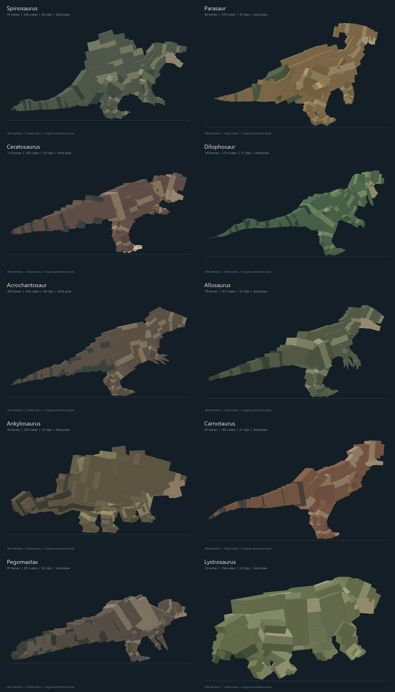

# Creature expansion — 2026-09-12

Ten new creatures join the existing nine. Their editable source projects, original ARK skeletons, all extracted animation clips, palette textures, previews and rebuild scripts are retained in `../../Creatures/`.



| Creature | Existing behavior family | Group | Minimum danger | Runtime body height |
| --- | --- | --- | --- | --- |
| Spinosaurus | BIG_CARNIVORE | 1 | 4 | 13.5 blocks |
| Parasaur | SMALL_HERBIVORE, timid | 4–6 | 1 | 4 blocks |
| Ceratosaurus | BIG_CARNIVORE | 1 | 3 | 5.6 blocks |
| Dilophosaur | SMALL_CARNIVORE | 4–6 | 1 | 1.9 blocks |
| Acrocanthosaurus | BIG_CARNIVORE | 1 | 5 | 14.4 blocks |
| Allosaurus | SMALL_CARNIVORE | 4–6 | 3 | 6 blocks |
| Ankylosaurus | BIG_HERBIVORE | 2–4 | 2 | 4 blocks |
| Carnotaurus | BIG_CARNIVORE | 1 | 3 | 6 blocks |
| Pegomastax | SMALL_HERBIVORE, timid | 4–6 | 1 | 1.3 blocks |
| Lystrosaurus | SMALL_HERBIVORE, timid | 4–6 | 1 | 1 block |

The existing family names describe gameplay profiles. Allosaurus deliberately uses the Raptor pack profile while keeping its own larger body and animations. Ceratosaurus reuses the solitary large-predator profile. Pegomastax reuses the timid forager profile. These choices keep the existing territory, shared hunger, loaded-chunk navigation budgets, group replenishment and nighttime routines.

Timid herds flee and share alarms; they are not treated as healthy defensive herds that intimidate predators. Ankylosaurus shares the Triceratops defensive herd model. Allosaurus's additive eating clip uses the same separate feeding animation controller as Rex/Raptor. Every new creature has explicit idle, walk, run, melee, eating and warning clip bindings, plus an authored quiet sleep pose. Models without a recognized head bone retain a stable idle pose with closed eyes for sleep.

Spawn weights and movement controls appear under each new entity ID in the existing server configuration. Biome tags are preferences, matching the existing population director; displayed regional danger remains the eligibility rule. Spinosaurus prefers rivers/swamps but uses land navigation and shore-access behavior. Existing population caps and planning/path budgets are unchanged. More species increase the selection pool, not the configured simultaneous population limit. Client cost varies with visible model complexity; Acrocanthosaurus has the largest imported rig. Interactive performance has not been measured.

## Sources and reproducibility

- Base game: Spino, Para, Dilo, Allosaurus, Ankylo, Carno, Pegomastax and Lystrosaurus.
- Local Workshop item `1522327484` (ARK Additions): `CeratosaurusAA_Mesh` and `Acro_Mesh`. The folder `Acrochantosaur` follows the user's spelling; the runtime ID is `acrocanthosaurus`.
- `.uasset.z` workshop files are decompressed only into `.work/`; compressed and decoded source hashes are preserved. Game/Workshop directories are not modified.
- Ceratosaurus and Acrocanthosaurus retain native bind rotations to preserve anisotropic bone scaling. Existing baked-axis models keep their established convention.
- 1,081 original mesh bones, 2,431 fitted cubes, 383 extracted clips and 18,453 source animation frames across the ten new projects.
- The playable mod imports seven clips per new creature, totaling 142 clips across all nineteen. Full original clip libraries remain in the source folders.

Re-extract/rebuild the ten projects from the repository root:

```powershell
python scripts/workflow.py --species Spinosaurus Parasaur Ceratosaurus Dilophosaur Acrochantosaur Allosaurus Ankylosaurus Carnotaurus Pegomastax Lystrosaurus
```

Add `--reuse-exports` for offline builds from preserved source exports. From `Ark/`, run `python tools/import_creatures.py`, `python tools/build_item_assets.py`, `python tools/verify_assets.py`, and `python tools/verify_expansion.py` to update and verify the runtime resources.

## Scope

These creatures reuse the existing generic wildlife AI. ARK-specific venom/projectiles, stealing, armor/resource harvesting, buffs, pack-leader bonuses, adrenaline/shield states and Spino stance switching are not implemented. Alternate source animation clips are preserved for later work. The source meshes are editable cuboid approximations with generated palettes.

Existing entity IDs, saved family IDs and the original nine enum ordinals are preserved. Newly registered entities require the updated mod on both server and clients. Removing this expansion later removes those entity registrations. No interactive client was launched; visual/gameplay balancing remains a user playtest.

## Validation

- All ten source projects passed every-frame hierarchy, key-reduction and forward-kinematics checks.
- All nineteen runtime resource graphs and all 142 selected clips passed asset checks.
- `verify_expansion.py` checked 120 runtime poses against the source cuboids after scale/root-motion conversion, including both native-axis rigs. Measured errors are in `creature-expansion-validation.json`.
- Data generation and the Gradle build passed, including all 26 JUnit tests. All 13 required headless GameTests passed, including the new entity registration, group identity and behavior-profile checks.
- The older synchronous population fixture now explicitly selects the supported legacy mode; its dry terrain cannot exercise the asynchronous water-habitat planner. This check does not establish natural-spawn coverage in every biome.
