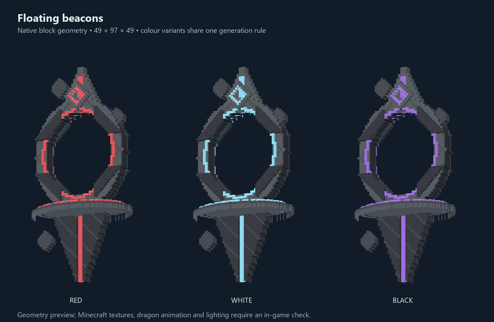

# First Guardian: floating beacons

P05 now uses Ark's own floating beacon and the authored dragon from I10. No Ancient Remnants
installation, Allosaurus hunt, heart, altar or activation interaction is required. A dragon appears
with each generated beacon, flies through and around its central opening, and defends that territory.

## Find a beacon

Explore **new Overworld chunks**, or use /locate structure arksurvivalreturns:sky_beacon.
The native structure set uses 32-chunk spacing and 30-chunk separation: neighbouring candidate
centres along either grid axis differ by 496–528 blocks (normally about 512). All three variants
share this set, so adding colours does not multiply beacon density. Terrain can reject a candidate.

Each original block template is 49 × 97 × 49, with a split taper, an open ring, detached plates,
a luminous diamond and a landing terrace. It starts at Y144 or at least 32 blocks above the highest
sampled terrain in its footprint, whichever is higher. Peaks that leave insufficient headroom are
skipped. Terrain adaptation is disabled. Existing chunks and player builds are not retrofitted.

The dragon is placed once by the structure template. Generation honours guardian.enabled,
the natural-spawn config switch and minecraft:spawn_mobs; when disabled at generation time the
beacon remains empty. The guardian is deliberately excluded from ordinary wildlife population
counts and never despawns.

For an operator preview, /place structure arksurvivalreturns:sky_beacon chooses a palette and
resolves altitude above the local terrain. /place template arksurvivalreturns:sky_beacon/red ~ ~ ~
places the red template at the command position; use sufficient open space and height.
The same template command accepts white and black.

## Dragon and variants

- Red beacon / red wyvern; pale blue beacon / white wyvern; violet beacon / black wyvern.
- Each uses its authored geometry, exact original atlas, and seven supplied animation clips.
  The original files under Creatures/Dragon/Dragon/out remain unchanged.
- The imported wyverns are also used by ordinary dragon creatures. Their existing behaviour
  role names alias the closest supplied clips; there are no newly authored bite, landing or death clips.
- Variants have the same combat rules and health; they are visual variants, not difficulty tiers.
- The beacon guardian is a separate entity (arksurvivalreturns:guardian_dragon), untamable,
  immune to sedation, persistent and independent of the legacy Guardian Giganotosaurus.
- It patrols the opening, attacks visible Survival players within 40 blocks of its saved home in
  three dimensions, and returns when they leave. Creative, spectator, downed and sedated players
  are excluded. Peaceful disables its aggression.
- The flying attack has a wind-up and rechecks range, sight and eligibility at impact. It damages
  an intruder without setting terrain on fire. It never deliberately follows a player below the
  beacon or across the map.
- Movement checks loaded chunks, world-border bounds and body collision. There are no chunk tickets.
- Home, palette, health and kill credit survive saves. Retreat does not regenerate health,
  remove the dragon or start a new ritual. A defeated beacon stays defeated.

Guardian config: baseHealth (400), damageMultiplier (1), armor (8), and barRange (64).
Health is fixed at spawn; extra players and tames do not change it. The nearby boss bar uses
the palette's colour.

## Victory

The killing player (or a tame's owner) receives tribe credit. A remembered attacker can receive
credit for a later environmental finish. Victory is saved per beacon before rewards are issued.
The trophy and the tribe's first Workshop Schematic drop at the central landing terrace, rather
than falling from the aerial kill location. The schematic flag remains authoritative if the
physical item is lost. Nearby members of the credited tribe receive journal/first_guardian,
which completes the journal's boss objective without any earlier quest or heart requirement.
The kill counts as boss XP.

The old optional Ancient Remnants ritual, its entity id, saved encounter records and operator
commands remain for existing saves; they are not used by newly generated beacons. I12 is no
longer a prerequisite for P05 and remains separate work for other bosses.

## Build and verification

- python tools/build_sky_beacons.py creates the three native NBT templates and worldgen JSON.
- python tools/import_creatures.py --dragon-only imports only the authored dragon variants.
- python tools/preview_sky_beacons.py renders the geometry preview above; it is not a game screenshot.
- runData generates names and test instances. build and runGameTestServer check gameplay.
- sky_beacon_assets, sky_beacon_placement, sky_beacon_persistence and sky_beacon_rewards
  cover structure registration/spacing, actual template entity placement, saved home/palette/wounds,
  attack exclusions, and one-time accessible progression rewards.

In-client visual review is still required for scale, wing clearance, flight animation, lighting,
and combat feel. The automated preview does not validate those artistic details.
