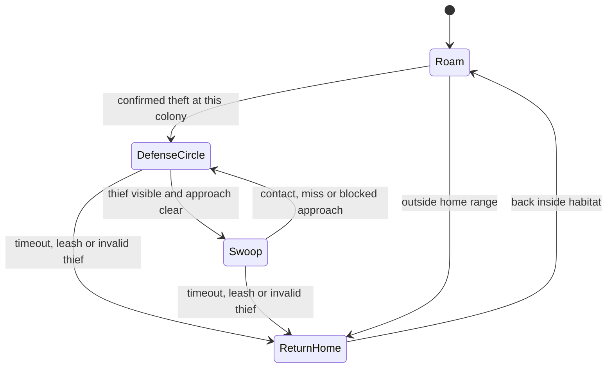

# Land Ecosystem & Behavior Patch: flying habitats

Proposal prepared 10 September 2026. Status: approved, including perching. Implemented on 11 September 2026; see [implementation and validation](flying-ecosystem.md). The following is the original proposed design. Applies to the two current flying species, Pteranodon and Argentavis. Runtime names retain `pteranodon` and `argentavis`.

## Recommendation

Make a persistent habitat the shared home of 3–4 birds, with several small nests and one map symbol. Birds move independently around that home. A server-confirmed egg-taking event is the only permission to attack a player. Use a small flight state machine and collision-aware steering adapted from Phantom's circle/swoop pattern, with the extracted species animations.

This replaces the flyers' land routines. It does not require ARK's behavior trees to execute inside Minecraft. The earlier ARK inventory contains names and interfaces, not decoded Blueprint logic; the comparison below is against this repository's executable Java behavior.

## Current implementation versus requested behavior

| Area | Current code | Proposed patch |
|---|---|---|
| Species/groups | Pteranodon 2–4; Argentavis 2–3 | Both 3–4. A colony counts as one group under the existing population cap. |
| Locomotion | `FlyingCreatureEntity` only classifies flyers and adjusts spawn weighting. Both use ground navigation. | Dedicated aerial movement with smooth yaw/pitch and collision checks. |
| Needs | `WildlifeGoal` builds a `WildlifeMind` with hunger/thirst/fatigue, including forage and water searches. | Flyers bypass these decisions and searches. Hunger and thirst remain inactive; optional landing is a timer, not a survival need. |
| Social behavior | Roaming can follow a lower-ID pack member; Argentavis uses 30-block cohesion. | Same habitat identity, independent orbit phase/radius/altitude; no leader following or formation requirement. |
| Aggression | Shared land perception, intrusion, threat and damage responses; Pteranodon is timid. | Egg theft records the responsible player. Approach, carried eggs from elsewhere, noise, another player's actions and direct damage alone do not authorize player attacks. |
| Habitat | Saved individual home coordinates; no nests. Argentavis lowlands are penalized, not prohibited. | Saved colony center plus nest positions. Pteranodon requires shoreline sand; Argentavis requires a configurable minimum altitude. |
| Eggs | Creative spawn eggs only. | Separate collectible species eggs in natural nests. They do not spawn a creature when used. |
| Animation | Five ground clips imported per bird. | Import existing flight/attack clips and connect animation state to the actual aerial movement phase. |
| Map | Optional Xaero fullscreen difficulty overlay; no habitat coordinates are sent. | Server-authoritative habitat markers, one symbol per discovered colony, using the installed fullscreen-map bridge. |

Relevant code: [FlyingCreatureEntity](../src/main/java/dev/nez/arksurvivalreturns/feature/creature/FlyingCreatureEntity.java), [CreatureEntity](../src/main/java/dev/nez/arksurvivalreturns/feature/creature/CreatureEntity.java), [Species](../src/main/java/dev/nez/arksurvivalreturns/feature/creature/Species.java), [WildlifeGoal](../src/main/java/dev/nez/arksurvivalreturns/feature/behavior/WildlifeGoal.java), [PopulationDirector](../src/main/java/dev/nez/arksurvivalreturns/feature/spawn/PopulationDirector.java), [SpawnRules](../src/main/java/dev/nez/arksurvivalreturns/feature/spawn/SpawnRules.java).

## Habitat and nest defaults

All numbers below are proposed tuning defaults, not existing behavior or measured optimal values.

| Parameter | Pteranodon | Argentavis |
|---|---|---|
| Adults per colony | 3–4 | 3–4 |
| Natural nest surface | Sand or red sand beside exposed water | Supported, dry high ground |
| Height requirement | Shoreline location; no arbitrary mountain preference | Nest floor at Y ≥ 96, configurable |
| Water requirement | Water within 12 horizontal blocks and 4 vertical blocks; verify a small connected patch so a single waterlogged block is insufficient | None |
| Nest appearance | Shallow bowl resembling a hollow in sand, with visible eggs | Low ring of twigs and fern-like foliage, with visible eggs |
| Nest cluster extent | Within 16 blocks of the center | Within 24 blocks of the center |
| Ordinary flight radius | Up to 32 blocks from center | Up to 48 blocks from center |
| Typical flight height | 6–18 blocks over nest elevation | 12–28 blocks over nest elevation |
| Player pursuit limit | 64 horizontal blocks from center; 30 seconds maximum | Same |

Require open sky and clearance for the whole bird, not only an empty center block. Validate every nest position before creating a colony. A sand nest should be a shallow custom block model placed on intact sand: its recessed shape supplies the hollow without excavating existing terrain. A fern nest should likewise be a compact block model that can stand on valid mountain terrain; actual vanilla fern placement requirements need not limit the habitat.

Use 3–4 small nest bowls distributed through each colony. Give each bird a preferred nest while retaining one shared habitat center. That produces a gathering of nests without making birds stand shoulder to shoulder. Start with one collectible egg per occupied nest. Hatching, breeding, incubation and recurring egg production need a separate gameplay decision; none is silently implied by this patch.

Natural placement remains inside the population director's loaded-chunk checks, danger eligibility, biome preferences, world border, game rules, collision checks and existing local cap of 24 Ark creatures. New nests and the complete bird group must succeed together or be rolled back. Existing nearby habitats should be reused rather than creating more nests whenever their birds despawn. Replenishment must check colony occupancy before adding birds, so 1–2 surviving members cannot become a 5–6 bird colony.

## State machine

Two main flight behaviors are sufficient: ordinary roaming and egg defense. Keep return/recovery as explicit phases so failure has a safe outcome.

- **Roam:** Fly between points on varying arcs around the saved center. Give each bird its own phase, direction and altitude. Change these occasionally; continuous random direction changes look twitchy.
- **Defense circle:** Keep orbiting within the habitat leash while selecting an approach to the actual thief. A short warning and staggered first dives make the reaction readable and avoid all four birds hitting simultaneously.
- **Swoop:** Descend toward the visible thief, apply damage only on real melee contact with line of sight, then climb back to a circling point. One hit per pass. Do not chase an unseen player through a roof or tunnel.
- **Return home:** Clear attack intent after timeout, invalid target, lost contact beyond a short grace period, or leaving the leash. Resume roaming when back in range. A blocked route gets a bounded climb/turn retry, not teleportation or a world-wide path search.

Direct attacks against an unprovoked bird may cause a short evasive movement using the roaming flight animation; they must not grant permission to attack the player. No sight/hearing/scent scan should independently create a combat target. Creative/spectator players and Peaceful mode remain excluded from player damage. During legitimate nest defense, health or obstruction may abort a dive.

**Optional addition worth including:** brief, staggered perching near an assigned nest, using the existing landing/takeoff clips. Only land when support and clearance are valid; otherwise continue flying. This makes nests look inhabited and costs little decision work, though landing alignment needs visual testing. It does not require hunger, thirst, fatigue or a day/night scheduler.

## Egg-taking contract

Use a server-side interaction on a nest to remove its egg and give/drop the corresponding collectible item. Mark the responsible player only after the server confirms that the egg was actually taken. Breaking an egg-bearing nest is also an egg disturbance by that player; breaking an empty nest is not a new theft.

Notify only living members of that habitat. Do not alarm every bird in hearing range. Track the player's UUID and expiry, not a generic nearest-player target. A bystander must remain safe even when standing closer. A later theft may select a new thief, but an inventory scan must never continuously renew aggression. Dropping the egg does not erase the original event, and repeatedly clicking an empty nest does not extend it.

Resolve egg interactions serially on the server so two players cannot both collect the same egg. Habitat/nest identity and consumed eggs survive save/reload; transient attack intent should clear on reload. There is no offscreen combat simulation or chunk loading to locate missing defenders.

## Phantom and extracted-animation reuse

I inspected the project's resolved Minecraft 26.2 source, specifically `PhantomCircleAroundAnchorGoal`, `PhantomAttackStrategyGoal`, `PhantomSweepAttackGoal` and `PhantomMoveControl` in the Gradle-provided source archive. Phantom already has a circle-around-anchor goal that runs without a target as well as between swoops. Its stock attack strategy can move the anchor above a target, so that part must be changed to preserve a habitat leash.

The inner goals are tied to `Phantom`. Adapt their movement pattern into the existing creature hierarchy rather than subclassing the hostile mob. Retain the ARK creature's dimensions, level scaling, damage and GeckoLib rendering. Use whole-body collision lookahead: our scaled birds are substantially larger than a Phantom.

| Presentation | Pteranodon extracted clip | Argentavis extracted clip |
|---|---|---|
| Roaming forward flight | `Ptero-Fly-Fwd` | `Argentavis-Fly-Fwd` |
| Hover/slow turn | `Ptero-Fly-Hover` | `Argentavis-Fly-Hover` |
| Attack approach | `Ptero-Fly-Attack-Swoop-Loop` | Forward flight with dive orientation |
| Contact attack | `Ptero-Fly-Attack-Bite` | `Argentavis-Fly-Attack-Claw` |
| Pull out of dive | `Ptero-Fly-Attack-Swoop-Out` | `Argentavis-Fly-Attack-Swoop-Out` |
| Optional landing/takeoff | `Ptero-Land`, `Ptero-Take-Off` | `Argentavis-Land`, `Argentavis-Take-Off` |

These names were verified in the extracted source animation JSON. They are available assets, not proof that their timing/alignment is correct at Minecraft scale. Extend [the existing importer](../tools/import_creatures.py), regenerate runtime copies, and keep source assets unchanged. Contact/pull-out/takeoff/landing clips must not accidentally loop. Flight cadence should follow its own movement state; the current controller calculates walking cadence from horizontal distance, which would mishandle hovering and steep dives.

## Xaero symbol

Use one small nest-and-egg glyph at the saved habitat center, with species color and a hover label containing species and coordinates. Do not display a waypoint for every bird or every nest. Use a separate nests toggle so switching the difficulty tint off does not hide nests.

The installed bridge exposes coordinate conversion and rectangle drawing through `MapOverlayContext` and `OverlayCanvas.fill`. A compact pixel glyph can therefore be drawn through the existing bridge without adding a renderer or texture dependency. Preserve the glyph as a small source asset/pattern so it is easy to revise.

Send discovered habitats only, with a bounded snapshot or incremental changes; do not send per-bird position updates for this feature. Save each player's discoveries, respect map access and the viewed dimension, and clear client caches on disconnect. Deduplicate by habitat ID. Hide unexplored centers using the existing exploration support. Remove or update a marker when its habitat is deliberately removed; do not remove the marker just because its birds are unloaded.

This proposal covers the installed **Xaero fullscreen World Map**. Its current bridge is not evidence of minimap icon support; a minimap marker would require a separate integration.

## Performance estimates and bounds

These are engineering estimates and work budgets, not measured FPS, RAM or MSPT results. Extra heap does not establish how much AI work the local server can sustain. The launch configuration currently sets a 12 GB heap despite the stated 16 GB setup; leave that setting alone unless changing it is requested. Render distance and entity simulation distance also need separate measurements.

| Mechanic | Proposed work bound | Expected impact |
|---|---|---|
| Removing land needs/perception from flyers | No food/water searches, predator selection, pack-leader lookup or broad sensory scans | Lower decision cost than the existing flyer land routine |
| Flight | Smooth steering/physics each entity tick; ordinary destination decisions every 10 ticks, staggered per bird | Small continuous CPU cost; collision lookahead is the main variable |
| Egg defense | Immediate theft event; only the offending player's eligibility/visibility is checked, at bounded intervals | Low idle cost; temporary extra work during attacks |
| Nest generation | Fixed attempt budget within the existing 5-second population pass; only loaded terrain; abort invalid sites | Occasional bounded spikes rather than ongoing nest scans |
| Nest persistence | Small saved records; no ticking block entity needed for an inert nest | Low ongoing cost; saved storage grows with explored colonies |
| Map symbols | One per discovered colony; bounded visible/submitted set, cached markers and change-based synchronization | Low compared with live per-entity map tracking |
| Imported animations | Client animation/rendering per visible bird | Needs measurement; current Pteranodon has 133 bones/287 cubes and Argentavis 131 bones/421 cubes |
| Optional perching | Slow timers and occasional support/clearance checks | Low server decision cost; extra visual QA |

At the current local cap of 24 Ark creatures, an all-flyer local population would contain 6–8 colonies and at most 48 ordinary decisions per second at a 10-tick cadence, plus 480 movement ticks per second at 20 TPS. This is a local example, not a dimension-wide cap: separated multiplayer players can have distinct populations. Keep global per-pass placement budgets and reuse counts for overlapping players.

Avoid full boid flock simulation, aerial hunting, global migration, offscreen needs, continual egg inventory scans and per-tick nest searches in this patch. Add variety through individual orbit settings, nest placement, brief perching and distinct species clips. These provide visible differences without increasing population.

## Design precedents

- Minecraft's official [Phantom description](https://www.minecraft.net/en-us/article/phantom) describes circling and diving attacks. The project's resolved Java source is the implementation reference used here; no Bedrock behavior JSON is assumed compatible.
- Expansive Worlds' [waterfowl developer diary](https://callofthewild.thehunter.com/developer-diary-waterfowl-rework/) describes home ranges, persistent groups and individual variation in altitude, approach and formation. The useful adaptation here is a shared home with different paths for each bird, avoiding synchronized motion.
- Epic's [behavior-tree overview](https://dev.epicgames.com/documentation/en-us/unreal-engine/behavior-tree-in-unreal-engine---overview) explains event-driven transitions. An explicit egg-theft event applies that principle here without importing an Unreal behavior-tree runtime.

## Implementation and validation sequence

1. Add the dedicated flight state/controller and gate aggression on recorded theft. Keep the land controller out of flyer ticks, including legacy save loads.
2. Add saved habitats, physical nest blocks and collectible eggs; integrate atomic, bounded colony placement and occupancy-aware replenishment.
3. Import the verified extracted clips, connect movement phases, and add the single habitat glyph through the optional map bridge.
4. Generate resources with `./gradlew runData`, then run `./gradlew build` and `./gradlew runGameTestServer`. Do not launch the interactive client automatically, per `Ark/AGENTS.md`.
5. Exercise actual flight and damage in GameTests: neutral approach/damage, successful theft, empty nest, two-player isolation, visibility/roof obstruction, one hit per pass, leash/timeouts, Peaceful/creative exclusions, save/reload, no population overflow and no chunk loads. Test packet bounds and habitat-marker deduplication.
6. User visual playtest: shoreline/mountain nest shape, wing/terrain clearance, flight yaw/pitch, attack timing, landing, map pan/zoom and labels. Compare server tick times and client frame times with matched populations at the intended render/simulation distances before claiming performance gains.

Existing levels and HP should survive migration. Existing birds can acquire suitable nearby loaded habitats through a bounded adoption process; they must not excavate builds or force terrain loads. Until a valid habitat is available, preserve a temporary local flight anchor. Spawn-egg/command birds should remain usable without automatically creating natural nests in player builds.

This file preserves the approved proposal. Current build/test results are recorded in [the implementation report](flying-ecosystem.md); visual verification remains pending. The unrelated land-nighttime work already present in `CHANGELOG.md` remains untouched.
