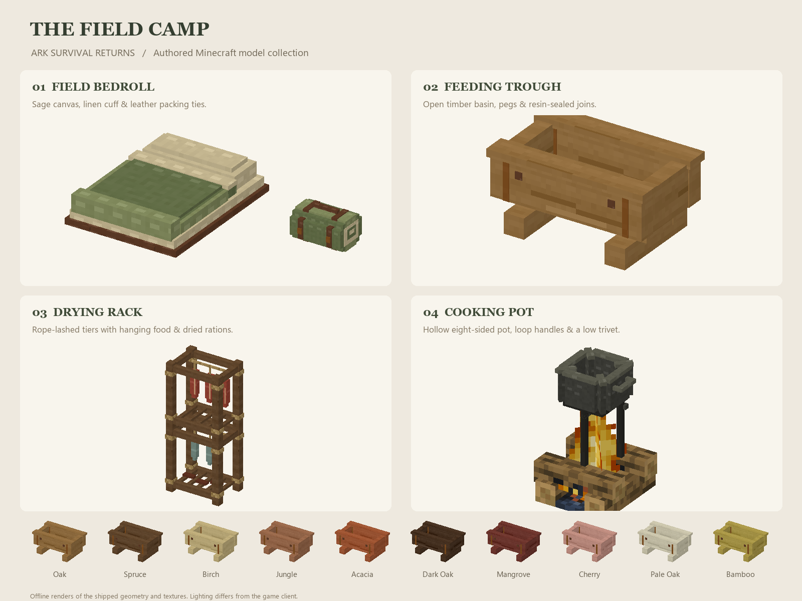

# Homestead Economy

Farm stations, food processing and field medicine (P04). Everything is server-authoritative, ticks
on a shared batch cadence and never advances in unloaded chunks, so an absence never produces a
windfall. Settings live under `[farm]` and `[kitchen]`.

## Stations and the batch cadence

Every station is a block entity that processes once per `farm.batchTicks` (default 100) only while its
chunk is loaded. A station has no offline catch-up, and player-built awareness from P03 still applies
to worker jobs. Batch counts are per station and configurable.

## Berry bushes

- The four Ark berries are plantable: use a berry on dirt, grass, farmland, coarse or rooted dirt,
  podzol, mycelium or moss (`#arksurvivalreturns:farm/plantable_on`) to plant its bush.
- Bushes grow by random tick through four vanilla-stage ages (brightness 9+, chance
  `farm.berryGrowthChance`). A ripe bush yields two to three of its berry on use and resets to age
  one; breaking a ripe bush drops the same through its loot table.
- Bushes are the renewable taming stock; planting and harvest produce no items beyond the berries.

## Feeding trough

- Ten matching wood finishes; four planks of one wood, one resin clump and one plant fiber.
  Pattern: `P P` / `PRP` / ` F ` (P = planks, R = resin, F = fiber).
- Combine one spruce log and one flint to make two resin clumps; both ingredients are consumed.
  This works without creakings, which the survival theme removes.
- The original `trough` id remains oak. The introductory journal task specifically requests oak;
  all finishes feed identically. Nonempty troughs show a bed of feed.

- Holds one food stack, capped by `farm.troughCapacity`. It accepts `#arksurvivalreturns:farm/trough_food`
  (the four berries, wheat and seeds, carrot, potato, beetroot, `#minecraft:meat`, `#minecraft:fishes`).
- Every batch it feeds up to `farm.troughMaxPerBatch` hungry **tamed** creatures within
  `farm.troughRadius`, removing `farm.troughFeedAmount` hunger and healing `farm.troughHeal`.
- Wild creatures are never fed: taming stays a player action. An empty hand takes the food back, and
  the stack drops when the trough is removed.

## Drying rack

- Right-click the top with another rack to stack a new tier; the uprights align automatically.
  Each tier has its own inventory and drying progress. The stack does not require sneaking.
- Hanging meat strips, fish or berry pouches show up to three raw portions. Finished rations
  appear on the slatted shelf; taking all contents clears the visual display.

- Holds raw food (`#arksurvivalreturns:farm/drying_inputs`) and converts one item per
  `farm.dryingBatches` batch into a **dried ration** (nutrition 6, travels in stacks of 64).
- The output fills first; an empty hand takes the ration, then the remaining raw input.

## Cooking pot

- Place on top of a campfire: its trivet reaches the logs, and the bowl clears the flames.
  A pot on another surface uses short feet and can still be opened.
- Cooking requires a **lit campfire immediately below**. Extinguishing/removing the fire pauses
  progress without consuming ingredients. The menu shows whether the pot has heat.

- Four ingredient slots and one meal slot, opened through its own menu (vanilla panel reused).
- All four slots must be filled and each loses exactly one item per meal. Fixed recipes:
  - **Hearty stew** — two dried rations, one meat (`#minecraft:meat`), one carrot. Regeneration for
    10 seconds. Nutrition 8, stacks to 16.
  - **Trail mix** — two dried rations, two Ark berries. Speed for 15 seconds. Nutrition 6.
- `kitchen.cookBatches` sets the batch count; `kitchen.enabled` disables the station.

## Field medicine

No station is required. Three narcoberries and a plant fiber craft a **concentrated sedative**
(`concentratedSedativePotency`, default 100), which can be eaten, swung or brewed into ammunition
through every route the narcoberry has. Four base tranquilizer arrows plus one concentrate craft four
**improved tranquilizer arrows** carrying that dose. The berry remains the cheap route.

## Smelting and storage

Vanilla furnaces are replaced (config `primitive.replaceFurnaces`): the Stone Fire cooks food and the
Primitive Forge smelts everything else, including charcoal. See the Prehistoric gate chart linked from
Dashboard.csv (F06).
The tame Load/Unload controls work with ordinary loaded containers such as chests and barrels.
Tom's Storage is the planned storage expansion, but it is not installed or required by this patch.

## Config quick reference

| Key | Default | Meaning |
|---|---|---|
| `farm.enabled` | true | Master switch for stations and bushes |
| `farm.batchTicks` | 100 | Shared station cadence |
| `farm.troughRadius` | 8 | Feeding reach |
| `farm.troughCapacity` | 32 | Food held per trough stack |
| `farm.troughHungerThreshold` | 60 | When a tame is fed |
| `farm.dryingBatches` | 6 | Batches per dried ration |
| `farm.berryGrowthChance` | 0.2 | Growth chance per random tick |
| `kitchen.enabled` / `kitchen.cookBatches` | true / 4 | Cooking pot |

## Automated coverage

`farm_batch` covers trough feeding and wild exclusion, all ten wood recipes (including resin),
stacked racks, inventory-driven food displays, drying cycles, bush harvest and chunk safety;
`medicine_dose` covers the dose order (berry < concentrate, arrow uses its configured dose);
`kitchen_cook` covers both recipes, campfire heat and extinguish/resume, trivet state changes,
one-item-per-slot consumption and chunk safety. The full
in-client checks are tracked in Dashboard.csv.

## Art and previews

Regenerate the authored assets with `python tools/build_camp_assets.py`, then regenerate their
wiring with `./gradlew runData`. `python tools/render_camp_assets.py` renders this offline sheet.
`python tools/verify_assets.py` also checks the native model references and all camp display states.
