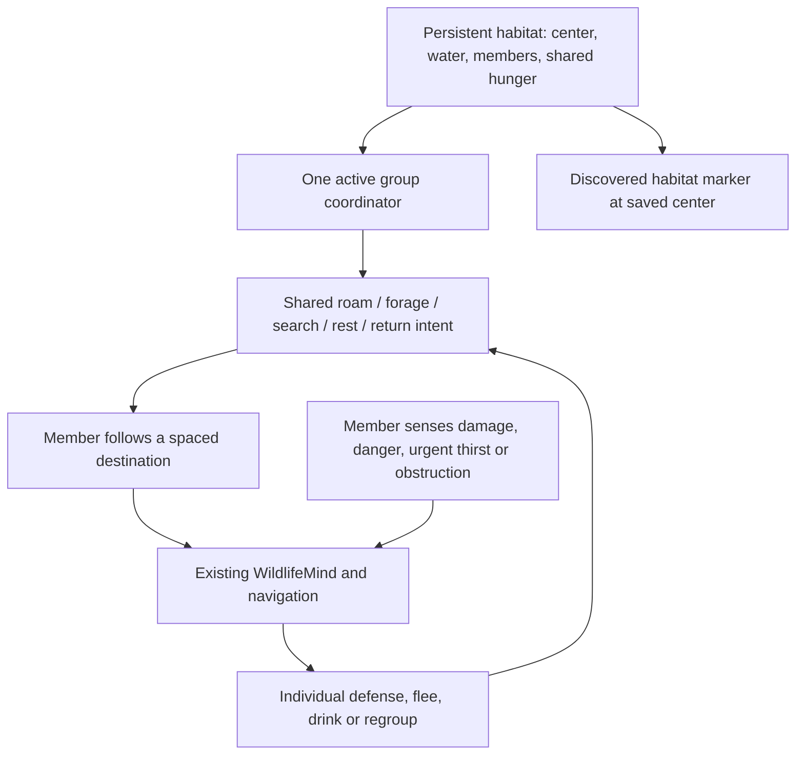

# Land Ecosystem & Behavior Patch — proposal

Date: 2026-09-11 (America/Sao_Paulo). Status: design and symbol assets prepared; gameplay implementation awaits feedback under [Standard.md](../../Standard.md). The values below are proposed tuning defaults, not measured results.

## Recommended direction

Extend the existing land state machine with a persistent habitat and a small group coordinator. Each natural group has one dry home coordinate near usable surface water, one shared hunger value, and one routine/destination. Members navigate individually with stable spacing and retain immediate reactions to danger. Solo creatures use the same record with capacity one.

This meets the requested behavior without replacing perception, combat, movement, nighttime routines or the flying controller. Habitat identity owns the group's lifecycle; the map displays that identity's saved center. A herd walking away must not drag its map marker along.

## Existing behavior compared with the request

The comparison is against the working source, including flying and nighttime work already present locally. Older changelog descriptions do not establish the state of that newer code.

| Request | Current implementation | Proposed change |
|---|---|---|
| Water-associated land habitats | Land homes are individual positions saved as `WildHomeX/Y/Z`. Nearby water is checked while thinking; thirsty animals sample up to 32 destinations every 200 ticks. Water proximity does not qualify a land habitat. | Validate a dry home plus usable drinking access before creating a natural land habitat. Apply a distance penalty and a hard exclusion boundary. Cache the result per habitat. |
| Herbivores roam less widely | Routine destination offsets are ±24 blocks per axis for grouped species and ±36 for solitary species. They are square sampling extents, not circular radii. Territory return limits are 80 blocks for herds/solitary creatures and 48 for other land creatures, using 3D distance. | Explicit family settings, circular horizontal bounds and a separate pursuit/escape limit. Herbivore ordinary ranges are smaller than either carnivore family's. |
| Shared satiation and decisions | `PackId` persists; grouped creatures follow a nearby lower entity ID and exchange alarms. Hunger, state, home and random destinations remain per entity. A wildlife kill satisfies only its attacker. | One authoritative group hunger clock and shared routine, center, direction and destination. Same-species neighboring groups retain distinct IDs. |
| Persistent habitat markers | Flyers already use saved colony IDs, discovered centers and a Xaero fullscreen overlay. Their saved format and packet encode species as an `argentavis` boolean and require nests. | Add a land record/payload and two land glyphs, reusing the discovery and overlay approach while preserving the existing flying save/packet contract. |
| Preserve existing behaviors | Land states include roam, forage, drink, rest, sleep, search, warning, hunt, defense, escape, regroup and return. | Feed shared routine intent into these states; retain individual safety and combat checks. |

Relevant source: [Species](../src/main/java/dev/nez/arksurvivalreturns/feature/creature/Species.java), [WildlifeMind](../src/main/java/dev/nez/arksurvivalreturns/feature/behavior/WildlifeMind.java), [WildlifeGoal](../src/main/java/dev/nez/arksurvivalreturns/feature/behavior/WildlifeGoal.java), [PopulationDirector](../src/main/java/dev/nez/arksurvivalreturns/feature/spawn/PopulationDirector.java), [flying saved habitats](../src/main/java/dev/nez/arksurvivalreturns/feature/flying/HabitatData.java) and [Xaero overlay](../src/main/java/dev/nez/arksurvivalreturns/client/XaeroHabitatOverlay.java). Graphify queries were also used; its older line references were cross-checked against the actual files. `FollowPackGoal` exists but is not registered by `CreatureEntity`; the active following logic is in `WildlifeGoal`.

## Families and initial distances

All distances below are horizontal blocks from the saved, dry habitat center. Whole-body collision, shore access and footprint support remain separate requirements. Ordinary destinations must satisfy a circular distance check. The return threshold is a soft outer boundary for pursuit or escape; it never teleports or prevents an immediate escape from danger.

| Family | Species in this roster | Current group | Proposed group | Full water weight through | Water exclusion at | Ordinary roam radius | Return threshold |
|---|---|---:|---:|---:|---:|---:|---:|
| Big carnivore | Rex, Giga | 1 | 1 | 32 | 96 | 96 | 160 |
| Small carnivore | Raptor | 3–5 | 4–6 | 24 | 80 | 80 | 128 |
| Titanosaur | Titanosaur | 1 | 1 | 24 | 64 | 64 | 112 |
| Big herbivore | Bronto, Trike, Therizinosaurus | 2–4, 2–4, 1 | 2–4 | 16 | 48 | 48 | 96 |
| Small herbivore | None currently available | — | 4–6 when a species is added | 12 | 32 | 32 | 64 |

Classifying Therizinosaurus as a big herbivore is the recommended explicit change; it currently lives alone. Its defensive temperament can remain species-specific. A new small herbivore is not included in this patch: prepare its family profile without inventing a species or relabeling Trike as small. Group sizes are initial/replenished capacity, not a guarantee that every member is alive at all times.

These are starting values for the requested 24-chunk view. The 30-block-wide Titanosaur needs a broad shore and meaningful maneuvering space, so it has its own profile. Do not give every herbivore the same small body clearance. A route outside loaded or entity-ticking terrain waits or chooses another local destination.

The current Bronto encounter creates a nearby solo Rex, then continually moves that Rex's home toward the herd. Keep the linked encounter, but constrain prey following to the Rex's own habitat range and stop overwriting its habitat center. Otherwise a supposedly fixed habitat would follow prey indefinitely.

## Water qualification and River Redux

Use real surface water and terrain geometry. River biome tags may help select candidates, but cannot prove that accessible water exists. A river biome can include dry banks or an inaccessible cliff.

For horizontal distance `d` to verified water, preferred distance `P` and exclusion distance `D`:

```text
waterWeight(d) = 1                         if d <= P
               (D - d) / (D - P)          if P < d < D
               0                         if d >= D
```

Multiply the existing biome/species weight by this factor. Reject zero before the current minimum-weight rounding, which otherwise clamps positive configured weights to at least one. A rejected candidate creates neither a natural creature group nor a habitat/marker. Spawn eggs and commands keep their usable temporary home and do not automatically register natural habitats in builds.

A successful candidate needs:

1. A supported dry anchor with room for the species' whole body and the complete group.
2. Exposed surface water, excluding isolated waterlogged blocks, with a small connected patch. Start with at least eight connected surface-water cells including a 2×2 area, using a bounded local flood search; make this threshold tunable for narrow rivers. This is a geometric rule, not proof of natural generation: a constructed pond can qualify.
3. A dry drinking approach with a valid local route, sensible vertical change and clearance for that species. Cache an approach per group and distinct standing offsets; members must actually reach water to drink.
4. Existing danger eligibility, biome preferences, border, game rules, local cap and collision checks. All placement paths, including the Bronto/Rex encounter, use the same registration gate and roll back records when a full encounter fails.

Use a reusable index of water samples in relevant loaded chunks. Scan incrementally with fixed work budgets, refine near candidate shorelines, and cache both successful and failed attempts briefly. Never scan an entire 24-chunk region per animal or call a chunk-loading lookup. If sampling is unfinished or a needed chunk is unloaded, the answer is **unknown**: defer that attempt. Unknown must not become a permanent dry classification or erase an existing habitat. Sparse sampling may miss a thin river; bounded later retries are preferable to forced exhaustive scans.

Recheck an occupied habitat at most once per 1,200 ticks, staggered, and revalidate its drinking point when used. A failed point triggers a bounded alternate-shore search. Confirmed persistent water loss disables replenishment and starts local relocation; unload alone does neither. Retain the same habitat ID during relocation and update the marker only after a valid replacement center is committed. Existing animals survive while no replacement is available.

River Redux's author page describes river generation and additional river biomes, not a guaranteed connected river network across every seed. Its currently listed versions reach 1.21.8, and its description lists TerraBlender as a requirement; this project targets Minecraft 26.2. River Redux is absent from the inspected pinned pack and local `client-mods` directory. Compatibility with this project's version is therefore unverified. The water detector can support terrain created by it without linking against its API; do not install an incompatible build or change world generation in this patch. [River Redux project page](https://modrinth.com/mod/river-redux)

## Group decisions and satiation

Add a dimension-local land habitat store, spatially indexed like the flying store. Each record saves a version, habitat ID, species/family, group ID, center, water approach, capacity, member UUID reservations, hunger, lifecycle status and discoveries. Runtime state includes routine intent, current destination/direction, decision revision and retry timers. Keep the entity's existing pack identity when adopting an old group.

A small coordinator advances each active group's hunger once for elapsed simulated ticks. Five member callbacks must not advance it five times. Freeze inactive groups; there is no offscreen hunger, movement or elapsed-wall-time catch-up. Expose this same normalized hunger value to members, keeping the existing convention that zero means satiated. Thirst, fatigue, health and immediate danger remain individual.

For herbivores, shared hunger chooses a grazing destination and routine. Lower group hunger only when members actually forage on valid ground; scale the existing depletion rate by active foragers divided by recorded living group membership. This avoids a single grazing member satisfying six animals at the full herd rate. At the initial threshold of 0.4, choose foraging; continue toward 0.1 before choosing an ordinary roam, retaining the existing hysteresis.

For carnivores, one confirmed non-player wildlife kill by a group member feeds its group once, using the existing satiation result of 0.05 and feeding pause. Deduplicate the event by victim UUID so simultaneous hits cannot multiply the reward. This is an intentional game abstraction consistent with shared satiation; prey biomass, carcass consumption and fractional nutrition are deferred. Nearby unrelated packs receive no food. Shared hunger stops further food-driven searching, while retaliation remains valid.

The coordinator chooses one routine destination and heading every 100–200 ticks, or 60–160 while searching. Members get stable UUID-based offsets relative to the heading and a short stagger before following. Offset spacing accounts for body width and remains within the family range; arrival slows movement, and blocked members try a few nearby slots instead of continuously aiming at the leader's feet. Select a stable coordinator identity from loaded members when necessary, but save decisions on the group record so a leader unloading does not reset hunger or home.

Do not add `FollowPackGoal` alongside this system: two movement goals issuing separate group destinations would compete. Replace the current per-member random-roam/leader query only where a valid group record is present. An unadopted legacy creature continues its existing routine.



Preserve the current day/night hunting gate, wake rules, threat signals, defensive behavior, low-health retreat, damage cadence and line-of-sight checks. A shared intent is the normal routine, not permission to make an injured creature keep fighting or a sleeping creature navigate. Sleep intent can be shared while existing individual transition delays remain. Urgent thirst uses the cached water approach. After an interruption, rejoin the current group plan instead of creating a new home.

## Habitat lifecycle and save migration

| Situation | Expected behavior |
|---|---|
| New natural group | Validate the site and full group, then commit members and habitat atomically. The map ID exists only after success. |
| Existing saved group | Adopt by existing `PackId`, using a bounded nearby water search. Seed shared hunger once from the loaded members' saved hunger, then retain that authority as others load. Preserve individual levels, HP, thirst and fatigue. |
| No suitable loaded water during adoption | Continue from the old home and retry later; do not teleport, delete the group or publish a false habitat. |
| One member dies or permanently despawns | Release that reservation once and allow a replacement only after a configurable cooldown, proposed 12,000 ticks, subject to normal caps and terrain. |
| Member or entire habitat unloads | Keep UUID reservations and pause work. Missing from a nearby entity query does not mean dead or eligible for replacement. |
| Last member dies | Mark the site vacant, keep the discovered coordinate and use the same cooldown before repopulating it. Prevent immediate farming loops. |
| Water/site becomes invalid | Pause new spawning, seek a loaded replacement site, commit relocation as one update. Keep the old anchor until a valid replacement exists. |
| Neighboring herds approach | Keep separate records and hunger; proximity never merges packs. |

Entity lifecycle hooks must distinguish unload/save from permanent removal. Reconcile memberships on entity load without scanning or loading saved chunks. UUID reservations are the authority for occupancy; local counts alone are insufficient when members spread across chunks. Retire obsolete duplicate records and their discovery entries during explicit migration/removal so repeated relocation does not grow abandoned markers.

Save the land records under a new versioned key. Do not reinterpret the flying codec's boolean species field or required nests as land data. Existing oversized or partial legacy groups are not culled; reconcile them without creating extra members above the allowed capacity.

## Two Xaero symbols

Prepared vector source assets extend the existing small pixel nest style:

| Herbivore habitat | Carnivore habitat |
|---|---|
|  |  |

Both use a 9×9 grid with two colors and transparent space. Their distinct silhouettes remain useful when colors are hard to distinguish. The existing [nest glyph](assets/habitat-symbol.svg) remains the flyer symbol.

During implementation, draw those exact source pixel patterns through the installed bridge's rectangle canvas, as the nest marker does. No new image-rendering library is required. Use a dark backing, stable screen size, hover label with family/species and saved XYZ, and a separate land-habitats toggle. Titanosaur uses the herbivore glyph, identified by its tooltip.

Add a bounded land payload with an explicit marker kind/species identifier, retaining the flying payload. Reuse its per-player discovered-center policy: proximity discovery in loaded terrain, explored-terrain masking, map entitlement and dimension filtering, disconnect cleanup, UUID deduplication, and update/removal synchronization. Never trust client-supplied habitat IDs to register sites.

Start with 128 land markers maximum per snapshot and unchanged-data suppression on the existing five-second cadence. Cap rendering to visible markers, aggregate overlapping symbols into a count with a list tooltip, and avoid per-creature or live-hunger map updates. Coarse lifecycle status may accompany changed records. Map absence cannot delete a server habitat.

The installed integration is **Xaero fullscreen World Map**. Minimap support is a separate integration and is not implied by these assets. The two SVGs are prepared design assets; they are not wired into the runtime by this proposal.

## Performance at 16 GB and 24 render chunks

The requested target is a local server with a 16 GB heap and 24 render chunks. Current inspected settings differ: `build.gradle` and the launcher specify 12 GB; local `options.txt` has render distance 16 and simulation distance 12. The implementation should align the launcher/client heap to 16 GB and the requested view to 24 while keeping simulation distance separately configurable. Use 12 simulation chunks for the initial comparison unless another value is supplied. An integrated local server shares the client's JVM; a dedicated server needs its own heap launch setting.

24 chunks is roughly 384 blocks along one axis from the player; it is a view setting, not an AI radius or an instruction to tick every habitat in view. Retain the 96-block population neighborhood, target of three groups, local cap of 24, five-second replenishment interval and two-group pass budget initially. These are local limits: separated multiplayer players can sustain separate populations.

All costs below are engineering estimates and proposed work limits, not measured milliseconds or memory guarantees.

| Mechanic | Work budget / control | Expected multiplayer impact |
|---|---|---|
| Shared hunger and intent | One update per active group every 20 ticks; event-driven feeding and membership changes | Low; eliminates duplicate normal-routine choices, but does not eliminate per-member perception or movement. |
| Group membership and cohesion | Maintain a loaded-member index; at most six members in a new group; stable slots and cached destinations | Low bookkeeping; reduces repeated broad entity searches. Local avoidance still needs testing. |
| Habitat water planning | At most 256 terrain probes per dimension tick, charging height/block/fluid reads; at most eight habitat candidate jobs per population pass; bounded queue with retries | Moderate during exploration, low when cached. Split jobs across ticks; do not run the whole water search inside each of the director's 96 candidate attempts. |
| Cached drinking checks | Verify only at cached edge/arrival points; slow revalidation every 1,200 ticks | Expected reduction in repeated grid scans. Existing `nearbyWater` can check up to 625 positions per Titanosaur decision. |
| Longer roaming paths | Reuse paths; stagger ordinary replans, at most one new ordinary path per member per 40 ticks; separate prompt danger response | Largest CPU uncertainty, especially for giant bodies and narrow banks. Benchmark before widening ranges further. |
| Habitat persistence | Small records plus UUIDs/discoveries; no offscreen tick or terrain generation | Low active CPU; disk/heap grow with explored habitats and player discoveries. Use loaded-chunk cache eviction and record cleanup. |
| Xaero symbols | 128 land markers/player maximum, at most 81 source pixels each, viewport culling and overlap aggregation | Bounded client work and small changed-only snapshots. Flyers retain their own existing cap. |
| Larger Raptor/Therizinosaurus groups | Raptor mean initial group changes from 4 to 5; Therizinosaurus from 1 to 3 | More entities in those encounters; the overall local cap stays 24. Rendering and collision can dominate the inexpensive coordinator. |

At 20 TPS, 24 land creatures at the existing ten-tick thought interval make 48 individual decision calls per second. Six four-member groups need only six additional coordinator updates per second at a twenty-tick cadence. All 24 still perform normal entity movement ticks. Do not present the coordinator as a sixfold reduction in total AI cost.

A 256-probe budget caps new water planning at 5,120 terrain probes per second per dimension at 20 TPS. This is a ceiling to tune downward under load, not guaranteed cheap work. Separate global job and path budgets prevent costs from multiplying unchecked as players spread out; overlapping players reuse the same group records.

## Design precedents and scope choices

TheHunter's developers connect home ranges, persistent groups and need zones with readable animal encounters. Adopt the stable-home idea and vary individual approaches to avoid perfectly synchronized movement. These are inspiration for this patch, not claims that this mod reproduces that game's simulation. [Expansive Worlds developer diary](https://callofthewild.thehunter.com/developer-diary-waterfowl-rework/)

Craig Reynolds' leader-following example combines arrival, separation and an offset destination. That supports spaced herd movement while retaining individual navigation. Use these limited principles without introducing a full flock simulation or replacing Minecraft navigation. [Reynolds: leader following](https://www.red3d.com/cwr/steer/LeaderFollow.html)

Include stable water access, shared routines/satiation, staggered body-aware formation slots, bounded regrouping, fixed habitat centers and delayed occupancy-aware replenishment. Defer seasonal migration, breeding, starvation damage, territory wars, carcass biomass, terrain depletion and a global predator/prey population simulation. They add gameplay scope and validation work beyond the requested families.

A hierarchical model is sufficient: habitat lifecycle → shared routine → existing individual state machine. Consider a utility planner later only if competing food/water sites and interrupted group travel repeatedly fail playtesting. The current request does not justify replacing the full behavior model.

## Implementation and acceptance checks after feedback

1. Add family settings and group-size changes. Add pure tests for distance weighting, exact hard boundaries, once-per-group hunger, forage participation, and duplicate feeding events.
2. Implement land saved records, incremental water planning, loaded membership reservations and atomic population integration. Cover the linked Bronto/Rex path as well as ordinary groups.
3. Connect shared intent to the existing land adapter, preserve combat/nighttime priority, and stop the linked Rex from moving its permanent home with prey.
4. Wire the two glyphs and bounded land packets into the optional fullscreen overlay; preserve flying saves, markers and behavior. Add localization/configuration documentation and data providers where needed.
5. Run `./gradlew runData` after provider changes and commit generated resources. Run `./gradlew build` and `./gradlew runGameTestServer`, as required by [Ark/AGENTS.md](../AGENTS.md). Run `graphify update .` after code changes.
6. GameTests must exercise wet/dry boundary registration, narrow and obstructed banks, unloaded chunks and zero forced chunk loads, complete 4–6/2–4/solo spawns, group isolation, once-only shared feeding, staggered actual movement, fixed homes, leader death/unload, partial unload without duplication, vacant cooldown, migration/save reload and habitat removal/packet deduplication. Keep existing nighttime, defense and movement regression checks passing.
7. Compare matched baseline/patched scenarios: one local player and separated/overlapping multiplayer players, 16 GB, render 24, simulation 12; include river exploration, steady populations, crowded banks, combat and return paths. Record p50/p95/p99 server tick time, navigation attempts, water probes, queue delay, entity counts, heap/GC and client frame times. Report measured regressions, not estimated FPS gains.
8. User playtest verifies giant-body shore clearance, group spacing, animations, river encounter frequency, and marker contrast/hover/pan/zoom. Do not launch `runClient` automatically.

This proposal changes no gameplay code, launch settings or player-facing implemented-change lists. The unfinished nighttime changelog entry remains intact. This turn adds the requested GitHub backup directive, this reviewable design and two symbol source assets. XML/glyph and documentation checks are appropriate here; gameplay builds and performance claims belong to implementation.

Planning validation: all 12 local documentation links resolved; both SVGs parsed as XML with 41 unique, in-bounds pixels each. A local rendering of the source rectangles was visually inspected alongside the existing nest glyph. This verifies the draft shapes, not their appearance in Minecraft or Xaero. No gameplay build, client session or performance benchmark was run for this planning change.
