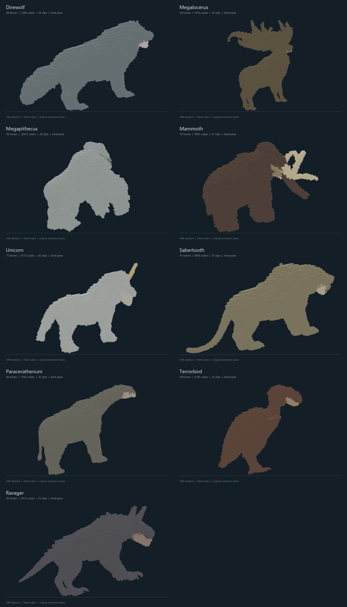
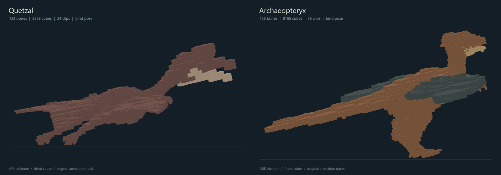
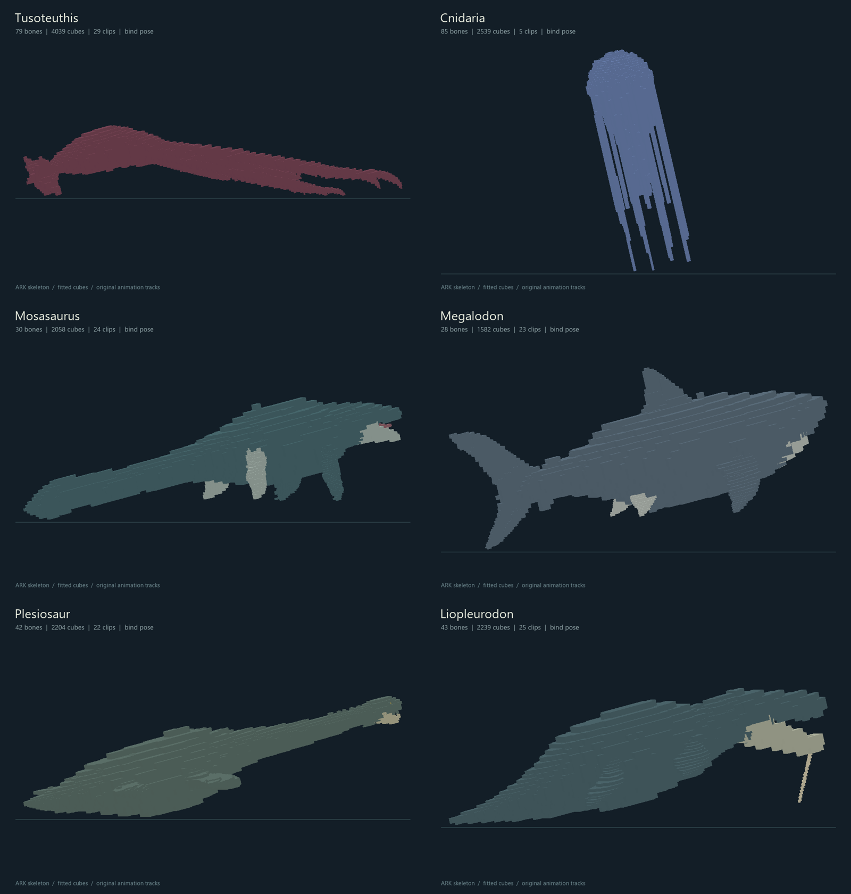
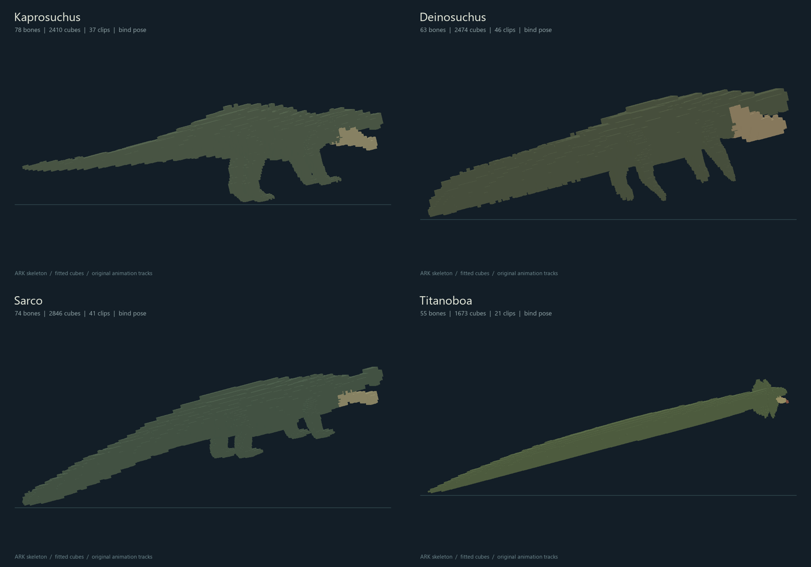

# Ice, flying, aquatic and swamp model collection

Twenty-one source projects are built directly from installed ARK meshes. Each retains its original named skeleton, complete extracted animation library, editable GeckoLib Blockbench project, geometry JSON, palette texture, source exports and rebuild script. Dreadnoughtus awaits an Ascended source in its [reserved folder](../Dreadnoughtus/README.md).

This collection adds no mod entities, behavior controllers or spawn rules.

The completed projects contain 1,583 original bones, 107,329 fitted cuboids and 696 imported clips. All 33,365 source animation frames passed validation.

| Group | Projects |
| --- | --- |
| Ice and other land creatures | [Direwolf](../Direwolf), [Megalocerus](../Megalocerus), [Megapithecus](../Megapithecus), [Mammoth](../Mammoth), [Unicorn](../Unicorn), [Sabertooth](../Sabertooth), [Paraceratherium](../Paraceratherium), [Terrorbird](../Terrorbird), [Ravager](../Ravager) |
| Flying | [Quetzal](../Quetzal), [Archaeopteryx](../Archaeopteryx) |
| Aquatic | [Tusoteuthis](../Tusoteuthis), [Cnidaria](../Cnidaria), [Mosasaurus](../Mosasaurus), [Megalodon](../Megalodon), [Plesiosaur](../Plesiosaur), [Liopleurodon](../Liopleurodon) |
| Swamp | [Kaprosuchus](../Kaprosuchus), [Deinosuchus](../Deinosuchus), [Sarco](../Sarco), [Titanoboa](../Titanoboa) |

Folder spellings follow the request. Megalocerus uses ARK's male Stag mesh; Megapithecus uses Gorilla; Sabertooth uses Saber; Quetzal uses Quetzalcoatlus; Ravager uses Aberration's CaveWolf; Titanoboa uses BoaFrill. Deinosuchus comes from the installed ARK Additions Workshop package. Dreadnoughtus is a separate Ascended creature; the older Rex project named `Rex_Ravager` is not used as a substitute for Ravager.

## Models and animation binding

Open the folder's `*_GeckoLib.bbmodel` in Blockbench with its GeckoLib plugin. Models, textures and all imported clips are embedded. The standalone geometry and animation JSON use exactly the same named bones. Edit cubes inside existing groups, preserving bone names, parent links, pivots and bind rotations.

Triangle surfaces are sampled into cells, then neighboring cells are merged without filling the gaps between tusks, antler branches, wings or tentacles. Every resulting cuboid belongs to an original bone. Fur cards become solid surface detail. These are dense source art projects; cube counts are recorded per creature. They have not been installed into the game or tested interactively in Minecraft/Blockbench.

The Mammoth, Direwolf and Sarco use their newer meshes and shared original animation skeletons. Megapithecus combines its base and fur skeletal meshes; secondary inverse binds are normalized onto the original animation skeleton, including the slight eye-bind differences. Unicorn's original static horn is transformed through the exported `UnicornSocket` on `c_neck3` and follows that animated bone. The raw horn and socket properties are retained.

The collection retains native bone rotations and full three-axis animation scaling. All original extracted clips are included, including water, flying, attack, death and special-action clips where present. Loop flags are inferred from names. Palette textures are generated; translucent fur, Cnidaria shaders, sounds and Unreal animation events are not recreated.

## Rebuild and verification

From the repository root:

```powershell
python -m pip install -r scripts/requirements.txt
python scripts/model_batch.py --reuse-exports
```

Omit `--reuse-exports` to re-extract from the local game/Workshop installation. Override `--content`, `--workshop` or `--umodel` for another installation. Rebuild one creature with its `rebuild.py`, or `python scripts/workflow.py --reuse-exports --species Mammoth`. Rebuilding replaces generated artwork.

Install `scripts/requirements-preview.txt` for accelerated depth-buffer previews of the dense meshes. Without it, the software renderer uses a simpler face-sorting fallback. No interactive client is launched.

Validation compares every source animation frame with the saved reduced JSON tracks, checks full affine bone transforms, source hashes, original hierarchy, Blockbench animation group IDs and equivalence of the two geometry formats. Cuboid merging also checks that sampled cell volume is preserved. The final counts and measured errors are in [model_batch_report.json](model_batch_report.json).

## Previews








